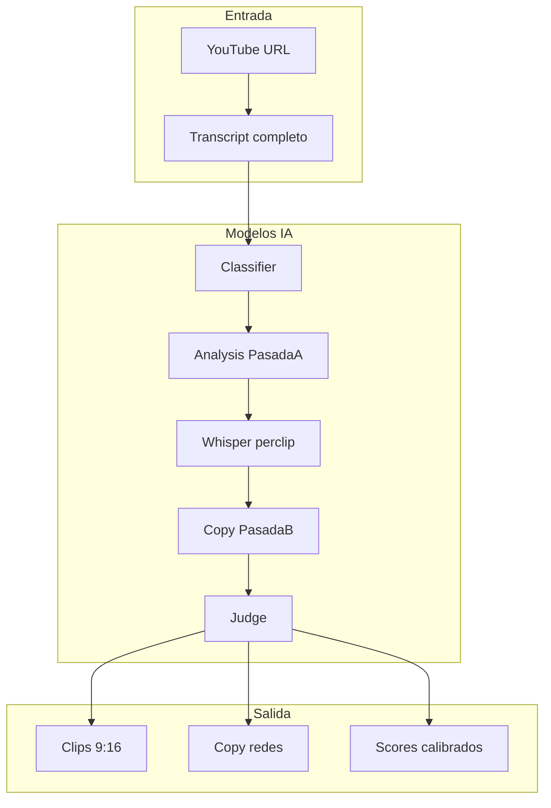
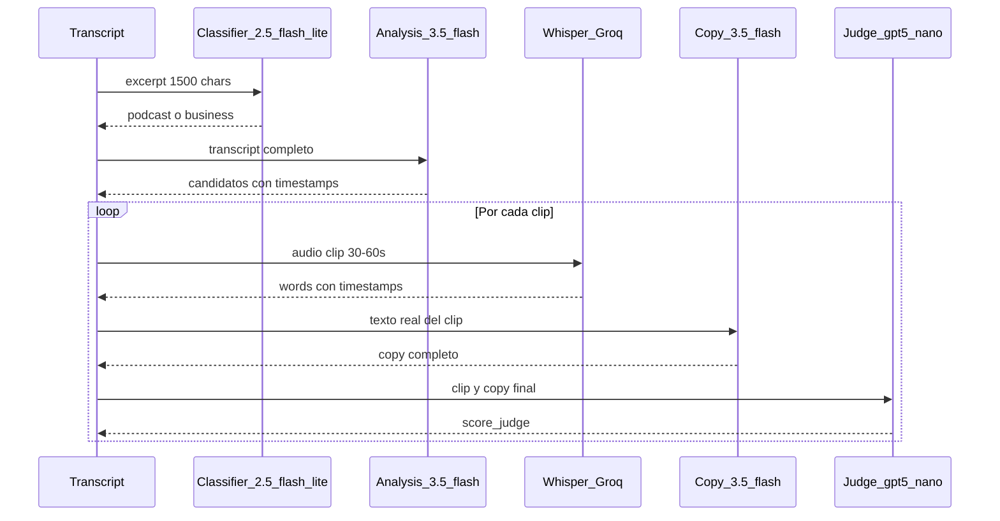

# Informe de Modelos LLM

Documento de referencia sobre los modelos de inteligencia artificial usados en el **YouTube Viral Content Engine**. Su objetivo es describir qué hace cada modelo, qué se espera de él y con qué características cuenta cada tarea, para poder en el futuro realizar un análisis exhaustivo y elegir la combinación óptima (calidad + economía).

**Documento complementario (recomendación de migración jul 2026):** [`RECOMENDACION_MODELOS_LLM.md`](RECOMENDACION_MODELOS_LLM.md)

Este informe cubre **solo la capa de IA**. No incluye costos en USD ni infraestructura de despliegue (ver canvas `costos-y-llms` para eso).

**Fuentes de verdad en código:** `worker/config/model_tiers.py`, `worker/config/llm_chat.py`, `worker/services/processor.py`, `worker/services/moment_selector.py`, `worker/services/scorer.py`, `worker/services/transcriber.py`, `worker/WORKER.md`.

**Estado de migración (jul 2026):** defaults actualizados en código y `.env.example`; `PROMPT_VERSION=v4`. Validación en golden set pendiente antes de dar por cerrada la migración en producción (ver [`RECOMENDACION_MODELOS_LLM.md`](RECOMENDACION_MODELOS_LLM.md)).

---

## 1. Objetivo de la aplicación

### Qué hace la app

Es un SaaS que convierte videos de YouTube en **clips virales 9:16** listos para TikTok, Reels y Shorts, junto con **copy para redes sociales** (Twitter/X, LinkedIn, TikTok) y un **análisis de viralidad** por clip.

### Flujo de valor

```
URL de YouTube
    → Transcripción del video completo
    → Clasificación del tipo de contenido
    → Detección de momentos virales (timestamps)
    → Descarga y corte de video + subtítulos + overlay
    → Transcripción precisa de cada clip (word-level)
    → Generación de copy desde el audio real del clip
    → Scoring independiente de calidad
    → Resultados en dashboard del usuario
```

### Rol de la IA en el sistema

Toda la inteligencia generativa vive en el **worker Python** (proceso en background en OVH VPS). El backend (Render) y el frontend (Vercel) **no llaman APIs de IA**: solo crean jobs, muestran progreso y renderizan resultados ya persistidos en Supabase (`score_llm`, `score_judge`, `whisper_words`, copy, URLs de clips).

### Pipeline de modelos IA



**Nota:** El transcript completo del video se obtiene primero vía Supadata o `youtube-transcript-api` (no es un modelo LLM). Los modelos Whisper se usan después, **por cada clip recortado**, para precisión de subtítulos y verificación de cortes.

---

## 2. Arquitectura de proveedores

| Proveedor | Modelos | Protocolo | Uso |
|-----------|---------|-----------|-----|
| **OpenRouter** | Gemini (y opcionalmente Claude vía env) | SDK `openai` → `https://openrouter.ai/api/v1` | Chat: clasificación, análisis, copy, juez |
| **Groq** | `whisper-large-v3-turbo` | SDK `openai` → `https://api.groq.com/openai/v1` | Transcripción per-clip (preferido) |
| **OpenAI** | `whisper-1` | SDK `openai` nativo | Fallback de transcripción; obligatorio para audio largo chunked |

### Configuración central

Archivos: [`worker/config/model_tiers.py`](../worker/config/model_tiers.py) + [`worker/config/llm_chat.py`](../worker/config/llm_chat.py)

- **`model_tiers.py`:** resuelve el modelo por tarea (`get_model`), temperature condicional, `max_tokens`, `reasoning.effort`, detección de Gemini 3.x / modelos deprecados.
- **`llm_chat.py`:** `build_chat_kwargs()` arma cada llamada a OpenRouter; `log_llm_usage()` registra `response.usage` (activo por defecto con `LOG_LLM_USAGE=true`).
- Orden de resolución de modelo: variable de entorno nueva → alias legacy → default en código.
- **Gemini 3.x:** `get_temperature()` devuelve `None` → no se envía `temperature` (recomendación de Google).
- **Modelos razonadores** (Gemini 3.x, GPT-5.x): `reasoning.effort` vía `extra_body` en OpenRouter; override por env `MODEL_{TASK}_REASONING`.
- `is_free_tier()` / `is_deprecated_model()`: advierten al arranque en `validate_env.py`.
- `resolved_models()`: imprime la config efectiva al iniciar el worker.

### Variables de entorno por tarea

| Tarea | Variable principal | Aliases / legacy | Reasoning default |
|-------|-------------------|------------------|-------------------|
| Análisis (selección) | `MODEL_ANALYSIS` | `OPENROUTER_MODEL` | `low` |
| Copy | `MODEL_COPY_WRITING` | `MODEL_COPY`, `OPENROUTER_COPY_MODEL`, `OPENROUTER_MODEL` | `minimal` |
| Juez | `MODEL_JUDGE` | — | `none` |
| Clasificador | `MODEL_CLASSIFIER` | `OPENROUTER_CLASSIFIER_MODEL` | — (no aplica en 2.5-flash-lite) |

---

## 3. Ficha por modelo

Cada subsección describe un modelo o proveedor de transcripción. La estructura es homogénea para facilitar comparación y futura optimización.

---

### 3.1 Classifier — `MODEL_CLASSIFIER`

| Campo | Detalle |
|-------|---------|
| **Modelo default** | `google/gemini-2.5-flash-lite` |
| **Variable env** | `MODEL_CLASSIFIER` |
| **Archivo fuente** | [`worker/services/processor.py`](../worker/services/processor.py) → `get_video_category()` |
| **Llamada LLM** | [`worker/config/llm_chat.py`](../worker/config/llm_chat.py) → `build_chat_kwargs("classifier", ...)` |
| **Temperature** | `0.0` (solo familia Gemini 2.x; omitida en 3.x) |
| **max_tokens** | `5` |
| **Reasoning** | No aplica (2.5-flash-lite no es razonador) |
| **response_format** | Texto libre (una palabra) |

> **Nota histórica:** el default anterior `gemini-2.0-flash-001` fue apagado por Google en jun 2026. Si producción no migró, el classifier caía al fallback de keywords sin error visible.

#### Qué hace hoy

Clasifica el video en una de dos categorías principales (`podcast` o `business`). Si `ENABLE_ENTERTAINMENT_CATEGORY=true`, añade `entertainment` como tercera opción. La categoría determina qué prompt de selección de momentos se usa downstream (enfoque conversacional vs monólogo/educativo).

#### Qué se espera que haga

- Devolver **exactamente una palabra** de categoría válida.
- Elegir el prompt especializado correcto para la Pasada A.
- No bloquear el pipeline: si falla, debe haber fallback inmediato.

#### Input típico

- Título del video (oEmbed).
- Descripción (hasta 300 caracteres; a menudo vacía en oEmbed).
- Inicio del transcript (~1500 caracteres), cuando está disponible.

#### Output esperado

String: `podcast`, `business` o `entertainment` (si está habilitado).

#### Cuándo se ejecuta

- **1 vez por job** (si no hay cache).
- Cacheable en `category_cache` (clave: video + modelo).

#### Fallos y fallbacks

1. Sin cliente OpenRouter → clasificación por keywords en título/descripción.
2. LLM devuelve categoría inválida → keywords.
3. Excepción de API → keywords.

Keywords de podcast: `podcast`, `entrevista`, `interview`, `episodio`, `invitado`, etc. Todo lo demás cae en `business`.

#### Requisitos de calidad

- Tarea simple y determinística: modelo flash barato con temperature 0.
- Error de categoría afecta el prompt de análisis pero no es catastrófico (business es el superset más amplio).

#### Criterios para evaluar alternativas

| Métrica | Por qué importa |
|---------|-----------------|
| Accuracy vs etiquetas manuales | ¿El prompt correcto mejora momentos? |
| Latencia | Impacto marginal (1 llamada pequeña) |
| Costo | Impacto muy bajo en el job total |
| ¿Eliminar LLM y usar solo keywords? | Ahorro mínimo; probar en golden set |

---

### 3.2 Analysis — Pasada A — `MODEL_ANALYSIS`

| Campo | Detalle |
|-------|---------|
| **Modelo default** | `google/gemini-3.5-flash` |
| **Variable env** | `MODEL_ANALYSIS` |
| **Archivo fuente** | [`worker/services/moment_selector.py`](../worker/services/moment_selector.py) |
| **Llamada LLM** | `build_chat_kwargs("analysis", ...)` + `log_llm_usage()` |
| **Temperature** | Omitida en Gemini 3.x (`None`); `0.3` si se usa familia 2.x vía override de env |
| **max_tokens** | `16000` (thinking tokens consumen el límite) |
| **Reasoning** | `low` (override: `MODEL_ANALYSIS_REASONING`) |
| **response_format** | JSON (`json_object` vía OpenRouter) |

#### Qué hace hoy

**Pasada A** del pipeline de dos pasadas (`TWO_PASS_ANALYSIS=true`, default). Selecciona momentos virales del transcript completo:

- Genera candidatos con timestamps (`start_time`, `end_time`).
- Asigna scores preliminares (hook, retention, shareability).
- Incluye `first_phrase_in_audio` y `last_phrase_in_audio` para verificación anti-alucinación de cortes.
- Produce hook conceptual y `viral_overlay` borrador (luego la Pasada B los refina).
- **No genera copy** (threads, LinkedIn, TikTok).

Sobre-generación: pide hasta `min(12, minutos_de_video)` candidatos, rankea por score y conserva los top N según duración:

| Duración video | Momentos finales |
|----------------|------------------|
| &lt; 90 s | 1 |
| 90 s – 5 min | 3 |
| &gt; 5 min | 5 |

#### Qué se espera que haga

- Identificar 1–5 momentos de **15–60 segundos** (mínimo 10 s).
- Usar timestamps **reales** del transcript (no inventados).
- Momentos standalone (comprensibles sin contexto previo).
- Máximo 20% de solapamiento entre candidatos.
- Oraciones completas al inicio y fin (`verification.first_phrase_in_audio`, `verification.last_phrase_in_audio`).
- Scores honestos en escala 1–10 (mayoría 5–7, no inflar).

#### Input típico

- Transcript completo con segmentos y timestamps.
- Metadata: título, duración, categoría (podcast/business).
- Instrucción de idioma de salida (`output_language_instruction`).
- Con `COMPACT_TRANSCRIPT=true` (default): transcript compactado (~50% menos caracteres).

Tamaño estimado: **20k–50k tokens** de input en videos de 30–60 minutos.

#### Output esperado (schema)

```json
{
  "video_title": "string",
  "summary": "string (max 200 chars)",
  "main_topics": ["string"],
  "viral_moments": [
    {
      "start_time": 120,
      "end_time": 155,
      "clipping_reason": "string",
      "hook": "string",
      "viral_overlay": "MAX 4 PALABRAS",
      "emotional_trigger": "Curiosidad | Miedo | ...",
      "pillar_type": "authority",
      "category": "business",
      "sentiment_detected": "serious",
      "scores": { "hook": 7, "retention": 6, "shareability": 8 },
      "verification": {
        "first_phrase_in_audio": "string",
        "last_phrase_in_audio": "string",
        "narrative_goal": "string"
      }
    }
  ]
}
```

#### Cuándo se ejecuta

- **1 vez por job** (si no hay cache hit).
- Cacheable en `analysis_cache` (clave: `video_id + model + tone + prompt_version`).

#### Fallos y fallbacks

| Condición | Comportamiento |
|-----------|----------------|
| `TWO_PASS_ANALYSIS=false` | Salta Pasada A; usa mega-prompt legacy en `processor.py` |
| Pasada A falla | Fallback al mega-prompt legacy |
| Mega-prompt legacy | `max_tokens=16000`; genera selección **y** copy en una sola llamada (copy queda como borrador hasta Pasada B) |

#### Requisitos de calidad

- Es la tarea de **mayor impacto en calidad del producto**: malos timestamps = clips inutilizables.
- Default jul 2026: **Gemini 3.5 Flash** con reasoning `low` (velocidad + calidad frontier); validar contra golden set vs el Pro legacy.
- El schema tolera scores incompletos (`ViralScores` infiere `shareability` si Gemini lo omite).

#### Criterios para evaluar alternativas

| Métrica | Por qué importa |
|---------|-----------------|
| Precisión de timestamps vs audio real | Core del producto |
| Tasa de `verification_failed` | Frases no matchean el audio |
| Recall de momentos virales | Golden set (`worker/eval/golden_set.json`) |
| Diversidad de momentos (no repetir ideas) | UX del dashboard |
| Latencia | 20–40 s típicos; afecta tiempo total del job |
| Costo por token | Mayor input del pipeline |
| ¿Flash basta vs Pro? | Hipótesis principal de optimización |

---

### 3.3 Copy — Pasada B — `MODEL_COPY`

| Campo | Detalle |
|-------|---------|
| **Modelo default** | `google/gemini-3.5-flash` |
| **Variable env** | `MODEL_COPY_WRITING` / `MODEL_COPY` |
| **Archivo fuente** | [`worker/services/processor.py`](../worker/services/processor.py) → `generate_moment_copy_full()`, `regenerate_moment_copy()` |
| **Llamada LLM** | `build_chat_kwargs("copy", ...)` + `log_llm_usage()` |
| **Temperature** | Omitida en Gemini 3.x; `0.65` en familia 2.x |
| **max_tokens** | `4000` |
| **Reasoning** | `minimal` (override: `MODEL_COPY_REASONING`) |
| **response_format** | `json_object` |

#### Qué hace hoy

**Pasada B**: genera el paquete completo de copy **después** de que Whisper transcribió el audio real del clip recortado. Corre **antes** de `generate_clip` para que el `viral_overlay` final sea el que se quema en el video.

Piezas generadas:

1. **twitter_thread**: exactamente 7 tweets (180–280 chars c/u), separados por `\n\n`.
2. **linkedin_post**: 800–1200 caracteres, hook de 3 líneas, pregunta final.
3. **tiktok_caption**: 1–2 líneas coloquiales + 3–4 hashtags.
4. **hook**: frase gancho del momento (1–2 líneas).
5. **viral_overlay**: máximo 4 palabras en mayúsculas (texto quemado en el clip).

Personalización inyectada: `jobs.tone` (profesional, sarcástico, motivador, casual), `users.display_name`, `users.professional_title`.

#### Qué se espera que haga

- Copy **fiel al transcript real** del clip (no inventar contenido ausente del audio).
- Respetar idioma del video (instrucción `output_language_instruction`).
- Cumplir reglas estrictas de formato (7 tweets, longitud LinkedIn, overlay corto).
- Evitar clichés de IA ("en el mundo de hoy", "descubre cómo", etc.).
- Mejorar el hook/overlay borrador de la Pasada A si es posible, siempre anclado al audio.

#### Input típico

- Clip transcript (hasta 4000 caracteres) — texto real post-Whisper.
- Categoría, trigger emocional, hook/overlay borrador.
- Tono y datos del creador.

#### Output esperado (schema)

```json
{
  "twitter_thread": "tweet1\n\ntweet2\n\n...",
  "linkedin_post": "string",
  "tiktok_caption": "string",
  "hook": "string",
  "viral_overlay": "CUATRO PALABRAS MAX"
}
```

#### Cuándo se ejecuta

- **~5 veces por job** (una por momento/clip).
- **No cacheable** (depende del corte real y del texto Whisper).
- Posible **retry**: si `content_validators.clean_moment()` detecta tweet count ≠ 7 o LinkedIn fuera de rango, se re-ejecuta `generate_moment_copy_full()`.

`regenerate_moment_copy()` existe para retries parciales (solo thread + LinkedIn).

#### Fallos y fallbacks

- Si Pasada B falla → se conserva copy del mega-prompt legacy (si existía).
- Si no hay texto de clip → se usa slice del transcript de YouTube como input alternativo ("copy rescue").

#### Requisitos de calidad

- Tarea **creativa** → temperature más alta (0.65) y modelo Flash (balance calidad/velocidad).
- El copy es lo que el usuario publica: impacto directo en percepción del producto.
- Validación automática post-LLM reduce riesgo de formato inválido.

#### Criterios para evaluar alternativas

| Métrica | Por qué importa |
|---------|-----------------|
| Pass rate de validación (7 tweets, LinkedIn length) | Sin retries = menos costo y latencia |
| Fidelidad al transcript | ¿Inventa contenido? |
| Calidad percibida del copy | Evaluación humana o proxy |
| Variación por tono | ¿Respeta sarcástico vs profesional? |
| ¿Modelo más barato mantiene validación? | Hipótesis de optimización |
| Costo por pieza × 5 clips | Impacto medio en job total |

---

### 3.4 Judge — `MODEL_JUDGE`

| Campo | Detalle |
|-------|---------|
| **Modelo default** | `openai/gpt-5.4-nano` |
| **Variable env** | `MODEL_JUDGE` |
| **Archivo fuente** | [`worker/services/scorer.py`](../worker/services/scorer.py) → `judge_moment_scores()` |
| **Llamada LLM** | `build_chat_kwargs("judge", ...)` + `log_llm_usage()` |
| **Temperature** | Omitida en GPT-5.x; `0.1` en familia Gemini 2.x |
| **max_tokens** | `400` |
| **Reasoning** | `none` (override: `MODEL_JUDGE_REASONING`) |
| **response_format** | `json_object` |

#### Qué hace hoy

Modelo **independiente** del de análisis y copy (**cross-family**: OpenAI juzgando outputs de Gemini). Puntúa cada clip final contra una rúbrica con anclas explícitas:

- **hook** (1–10): ¿los primeros 3 segundos frenan el scroll?
- **retention** (1–10): ¿mantiene atención hasta el final?
- **shareability** (1–10): ¿alguien lo compartiría?

Incluye `reasoning` (1–2 frases justificando los scores).

**Problema que resuelve:** el modelo de análisis se auto-evaluaba (scores 7–9 sistemáticos). El juez calibra con escala honesta (mayoría 4–7).

#### Qué se espera que haga

- Evaluar solo el **texto real del clip** + overlay + hook (no asumir contenido visual).
- Penalizar clips que cortan a mitad de frase (retention no puede ser &gt; 5).
- Devolver JSON válido con scores enteros.
- Los scores **mostrados al usuario** son `score_judge`, no `score_llm`.

#### Input típico

- Transcript del clip (hasta 3000 caracteres).
- Overlay quemado, hook propuesto, categoría, duración en segundos.

#### Output esperado (schema)

```json
{
  "hook": 6,
  "retention": 7,
  "shareability": 5,
  "reasoning": "1-2 frases"
}
```

#### Cuándo se ejecuta

- **~5 veces por job** (una por clip finalizado).
- **No cacheable** (depende del clip y copy finales).

#### Fallos y fallbacks

- Si el juez falla (`None`) → el caller conserva los scores del análisis (`score_llm`).
- `roi_time_saved` se calcula de forma **determinística** (fórmula fija en `scorer.py`), no por LLM.

#### Requisitos de calidad

- Tarea estructural y de alto volumen (~5 llamadas/job).
- **Cross-family** reduce sesgo de auto-evaluación (mismo problema que scores 7–9 de la Pasada A).
- `reasoning: none` evita que los thinking tokens consuman el `max_tokens=400`.

#### Criterios para evaluar alternativas

| Métrica | Por qué importa |
|---------|-----------------|
| Correlación juez vs evaluación humana | ¿Los scores guían al usuario? |
| Delta `score_llm` vs `score_judge` | Calibración (golden set) |
| Estabilidad JSON | `response_format` + json_repair |
| ¿Eliminar juez? | Pierde calibración; ahorro bajo |
| ¿Modelo más capaz mejora correlación? | Trade-off costo vs utilidad |

---

### 3.5 Whisper Groq — `whisper-large-v3-turbo`

| Campo | Detalle |
|-------|---------|
| **Modelo** | `whisper-large-v3-turbo` |
| **Proveedor** | Groq (`GROQ_API_KEY`) |
| **Archivo fuente** | [`worker/services/transcriber.py`](../worker/services/transcriber.py) |
| **Formato respuesta** | `verbose_json` con `timestamp_granularities: ["segment", "word"]` |

#### Qué hace hoy

Transcripción **word-level** de cada clip de audio recortado. Usado para:

- Generar subtítulos precisos en el video 9:16.
- Refinar límites de corte (`refine_bounds_to_sentences` en clip_generator).
- Verificar que `first_phrase_in_audio` / `last_phrase_in_audio` matchean el audio real.
- Alimentar la Pasada B con texto fiel al clip.
- Calcular métricas: `sub_coverage`, `words_per_sec`, `verification_failed`.

Vocabulario de marca vía `prompt` (hasta 900 chars): términos como "Claude", "Claude Code" que Whisper suele mal transcribir. Correcciones post-hoc fonéticas en `_BRAND_PHONETIC_CORRECTIONS`.

#### Qué se espera que haga

- Palabras con timestamps precisos por clip (~30–60 s).
- Detectar idioma correctamente.
- Mejorar accuracy con contexto (título, hook, slice del transcript YT).

#### Input típico

- Archivo de audio del clip (WAV/MP3 extraído por FFmpeg).
- Duración típica: 30–60 segundos por momento.

#### Output esperado

```json
{
  "text": "string",
  "language": "es",
  "duration": 45.2,
  "segments": [{ "start": 0.0, "end": 2.5, "text": "..." }],
  "words": [{ "word": "hola", "start": 0.1, "end": 0.4 }]
}
```

#### Cuándo se ejecuta

- **~5 veces por job** (una por clip).
- También en `clip_edit_processor.py` al re-renderizar clips editados.
- Transcript del video completo: **no** usa Whisper (usa Supadata/YT API + `transcription_cache`).

#### Fallos y fallbacks

- Si Groq falla o no hay `GROQ_API_KEY` → fallback a OpenAI `whisper-1`.

#### Requisitos de calidad

- **Crítico** para subtítulos, verificación de cortes y copy fiel.
- Groq elegido por velocidad y costo (~9× más barato que OpenAI por minuto).

#### Criterios para evaluar alternativas

| Métrica | Por qué importa |
|---------|-----------------|
| WER (word error rate) en clips de prueba | Subtítulos legibles |
| `sub_coverage` | % del clip cubierto por subtítulos |
| `verification_failed` rate | Frases no matchean |
| Latencia por clip | Impacto en tiempo total del job |
| ¿Solo Groq sin fallback OpenAI? | Simplifica; riesgo si Groq cae |

---

### 3.6 Whisper OpenAI — `whisper-1`

| Campo | Detalle |
|-------|---------|
| **Modelo** | `whisper-1` |
| **Proveedor** | OpenAI (`OPENAI_API_KEY`) |
| **Archivo fuente** | [`worker/services/transcriber.py`](../worker/services/transcriber.py) |

#### Qué hace hoy

Mismo rol que Groq Whisper, como **proveedor de respaldo**:

1. Cuando Groq no está configurado o falla en `_transcribe_single()`.
2. En `_transcribe_chunked()` para videos de audio **mayores a 20 minutos** (obligatorio; Groq no se usa en ese path).

#### Qué se espera que haga

- Misma estructura de output (segments + words).
- Misma calidad de timestamps para el pipeline downstream.

#### Cuándo se ejecuta

- Fallback esporádico en clips normales.
- Chunked transcription en casos de audio largo (menos frecuente en el flujo per-clip actual).

#### Criterios para evaluar alternativas

| Métrica | Por qué importa |
|---------|-----------------|
| Paridad de accuracy Groq vs OpenAI | ¿El fallback degrada calidad visible? |
| Costo si Groq no disponible | ~9× más caro por minuto |
| ¿Mantener dual-provider? | Resiliencia vs simplicidad |

---

## 4. Matriz comparativa de características

Tabla resumen para priorizar qué tarea optimizar primero:

| Tarea | Creatividad | Estructura | Input size | Output size | Llamadas/job | Cacheable | Impacto calidad | Impacto costo |
|-------|-------------|------------|------------|-------------|--------------|-----------|-----------------|---------------|
| Classifier | Baja | Alta | Pequeño | Mínimo | 1 | Sí | Medio | Muy bajo |
| Analysis (Pasada A) | Media | Alta | Muy grande | Grande | 1 | Sí | **Crítico** | Alto |
| Copy (Pasada B) | **Alta** | Media | Medio | Grande | ~5 | No | **Crítico** | Medio |
| Judge | Baja | Alta | Medio | Pequeño | ~5 | No | Alto | Bajo |
| Whisper (Groq) | N/A | Alta | Audio | Medio | ~5 | Parcial | **Crítico** | Bajo |

### Llamadas totales por job (happy path)

| Tipo | Cantidad aproximada |
|------|---------------------|
| Chat (OpenRouter) | ~12 (1 classifier + 1 analysis + 5 copy + 5 judge) |
| Speech-to-text | ~5 (Whisper per-clip) |
| **Total IA** | **~17 llamadas** |

---

## 5. Pipeline de dos pasadas (decisión de diseño)

### Problema original

Cuando el copy se generaba en la misma pasada que la selección de momentos (mega-prompt legacy), el texto publicado **no coincidía** con el audio real del clip recortado. El modelo elegía momentos sobre el transcript completo pero el corte final podía diferir.

### Solución actual (`TWO_PASS_ANALYSIS=true`)



| Pasada | Modelo tier (default jul 2026) | Responsabilidad |
|--------|--------------------------------|-----------------|
| **A** | Gemini 3.5 Flash (reasoning low) | Selección de momentos, timestamps, scores preliminares |
| **B** | Gemini 3.5 Flash (reasoning minimal) | Copy desde audio real post-Whisper |
| **Juez** | GPT-5.4 nano (reasoning none) | Scoring independiente cross-family |

### Implicación para optimización

**No conviene un solo modelo para todo el pipeline.** Cada tarea tiene requisitos distintos:

- Analysis: contexto largo + razonamiento estructural.
- Copy: creatividad + adherencia a reglas de formato.
- Judge: evaluación crítica barata e independiente.
- Whisper: precisión temporal, no generación de texto.

Cambiar un modelo sin evaluar su tarea específica puede degradar calidad sin ahorro proporcional.

---

## 6. Marco para futura optimización de modelos

Esta sección define **cómo** realizar el análisis exhaustivo que permitirá llegar a la combinación óptima y económica.

### Dimensiones a evaluar por tarea

| Dimensión | Descripción | Herramienta |
|-----------|-------------|-------------|
| **Calidad** | Output cumple criterios de la ficha | Golden set + métricas por tarea |
| **Latencia** | Tiempo de respuesta y tiempo total del job | Logs del worker |
| **Costo** | Tokens/minutos consumidos | `job_usage_events` + panel `/admin/usage` (Recharts, benchmarks rolling) |
| **Estabilidad JSON** | Respuestas parseables sin repair | Tasa de fallos en producción |
| **Idioma** | Calidad en español (prioritario) | Videos de prueba en ES |

### Herramientas existentes en el repo

Documentación completa: **[`worker/eval/README.md`](../worker/eval/README.md)** (tiers, plan de trabajo, VPS).

```bash
python worker/eval/run_golden_set.py --tier smoke      # ~2 min, pre-deploy
python worker/eval/run_golden_set.py --tier analysis   # default CI
python worker/eval/run_golden_set.py --tier full       # + copy + juez
python worker/eval/run_golden_set.py --tier full --json 2>run.log > report.json
```

**Métrica clave:** `phrase_anchor_pass_rate` (frases citadas existen en el clip, fuzzy).  
`verification_strict_pass_rate` es informativa (match literal — suele ser baja).

**VPS:** `docker compose -f docker-compose.worker.yml exec worker python eval/run_golden_set.py --tier smoke`

Umbrales: [`worker/eval/golden_set.json`](../worker/eval/golden_set.json). Cache: `PROMPT_VERSION=v4`.

### Hipótesis candidatas a testear

| Tarea | Hipótesis | Riesgo si falla |
|-------|-----------|-----------------|
| Analysis | `gemini-3.5-flash` (actual) vs `gemini-2.5-pro` / futuro `3.5-pro` | Timestamps incorrectos, momentos débiles |
| Copy | `gemini-3.5-flash` vs `gpt-5.4-mini` (A/B golden `--copy`) | Más retries, copy genérico |
| Judge | `gpt-5.4-nano` vs juez Gemini legacy | Menor independencia del scoring |
| Classifier | Solo keywords vs `2.5-flash-lite` | Categoría incorrecta en edge cases |
| Whisper | Solo Groq, sin fallback OpenAI | Jobs fallan si Groq cae |

### Proceso recomendado (no cambiar todo a la vez)

1. **Baseline:** correr golden set con configuración actual de producción (documentar modelos efectivos del `.env` VPS).
2. **Una variable por experimento:** cambiar solo `MODEL_ANALYSIS`, medir, revertir o mantener.
3. **Registrar métricas:** por cada experimento, anotar pass rate de validación, `verification_failed`, delta juez vs LLM, latencia.
4. **Priorizar por impacto:** Analysis y Copy primero (críticos + mayor costo). Classifier y Judge al final.
5. **Monitorear costo real:** panel admin `/admin/usage` con KPIs, desglose por task/modelo/proveedor, margen bruto y detalle por job con pipeline colapsable. Benchmarks rolling de los últimos N jobs reemplazan comparaciones hardcodeadas. Calibrar `pricing.py` vs facturas OpenRouter/Groq si la desviación supera ~15%.

### Métricas de costo en panel admin

| Vista | Qué muestra |
|-------|-------------|
| `/admin/usage` | KPIs del período, margen ingreso vs costo, charts Recharts, tabla de jobs |
| `/admin/usage/jobs/[id]` | Pipeline por tarea, comparación real vs benchmark, eventos granulares |
| Canvas `costos-y-llms` | Escenario "Medido (1er job prod)" recalibrado vs legacy |

### Métricas de producción ya persistidas

Útiles para evaluar calidad sin golden set manual:

| Campo | Origen | Indica |
|-------|--------|--------|
| `score_llm` | Pasada A | Auto-evaluación (puede estar inflada) |
| `score_judge` | Judge | Score mostrado al usuario |
| `verification_failed` | Post-Whisper | Corte no matchea frases |
| `sub_coverage` | Post-Whisper | Cobertura de subtítulos |
| `words_per_sec` | Post-Whisper | Densidad del audio |

---

## 7. Configuración actual y discrepancias

Existen **tres capas** de configuración de modelos. Los valores efectivos en producción dependen del `.env` del VPS (no versionado).

| Capa | Analysis | Copy | Judge | Classifier |
|------|----------|------|-------|------------|
| **Defaults en código** (`model_tiers.py`, jul 2026) | `gemini-3.5-flash` | `gemini-3.5-flash` | `gpt-5.4-nano` | `gemini-2.5-flash-lite` |
| **`.env.example`** | `gemini-3.5-flash` | `gemini-3.5-flash` | `gpt-5.4-nano` | `gemini-2.5-flash-lite` |
| **Producción VPS** | Desconocido desde repo | Desconocido | Desconocido | Desconocido |

### Notas importantes

- **Migración jul 2026:** ver [`RECOMENDACION_MODELOS_LLM.md`](RECOMENDACION_MODELOS_LLM.md). Código y `.env.example` alineados; validar en VPS y con golden set antes de dar por cerrada la migración.
- **Modelos `:free`** en OpenRouter: el worker advierte al arranque (`is_free_tier()`). No recomendados para producción.
- **Gemini 2.0 apagado (jun 2026):** `validate_env.py` advierte si algún modelo apunta a `gemini-2.0-flash*`.
- **`TWO_PASS_ANALYSIS`**: default `true`. Solo desactivar para debugging o comparación con mega-prompt legacy.
- **`ENABLE_ENTERTAINMENT_CATEGORY`**: default `false`. Activar solo cuando Pasada A esté estable con categoría entertainment.

### Toggles del pipeline que afectan modelos

| Variable | Default | Efecto en IA |
|----------|---------|--------------|
| `TWO_PASS_ANALYSIS` | `true` | Pasada A + B vs mega-prompt único |
| `COMPACT_TRANSCRIPT` | `true` | ~50% menos input en analysis |
| `ENABLE_ENTERTAINMENT_CATEGORY` | `false` | Tercera categoría + prompt distinto |
| `GROQ_API_KEY` | opcional | Sin ella, Whisper usa solo OpenAI |

---

## Próximos pasos — Checklist para análisis exhaustivo

- [ ] Documentar modelos efectivos en producción (logs de arranque de `validate_env.py` o `.env` VPS).
- [ ] Correr `run_golden_set.py` con config actual → guardar baseline de métricas.
- [ ] Correr `run_golden_set.py --copy` → baseline completo con copy y juez.
- [ ] Experimentar `MODEL_ANALYSIS` (3.5-flash vs 2.5-pro / futuro 3.5-pro) → timestamps y `verification_failed`.
- [ ] Experimentar `MODEL_COPY_WRITING` (3.5-flash vs gpt-5.4-mini) → pass rate de validación.
- [ ] Evaluar correlación `MODEL_JUDGE` (gpt-5.4-nano) vs evaluación humana.
- [ ] Confirmar que Classifier LLM mejora vs solo keywords en golden set.
- [ ] Medir paridad Groq vs OpenAI Whisper en clips de prueba.
- [x] Logging de `response.usage` por llamada chat (`log_llm_usage`, `LOG_LLM_USAGE`).
- [x] Defaults y `.env.example` alineados (jul 2026); `PROMPT_VERSION=v4`.
- [ ] Decidir configuración final tras golden set y fijar en `.env` del VPS.

---

*Última revisión: migración modelos jul 2026 — alineado con `model_tiers.py`, `llm_chat.py`, `PROMPT_VERSION=v4`.*
