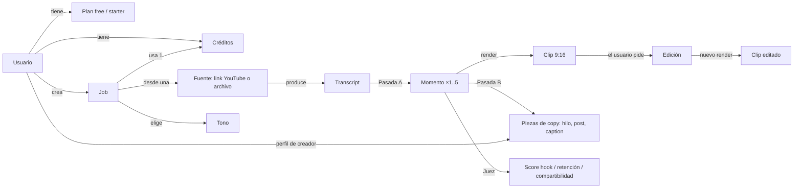
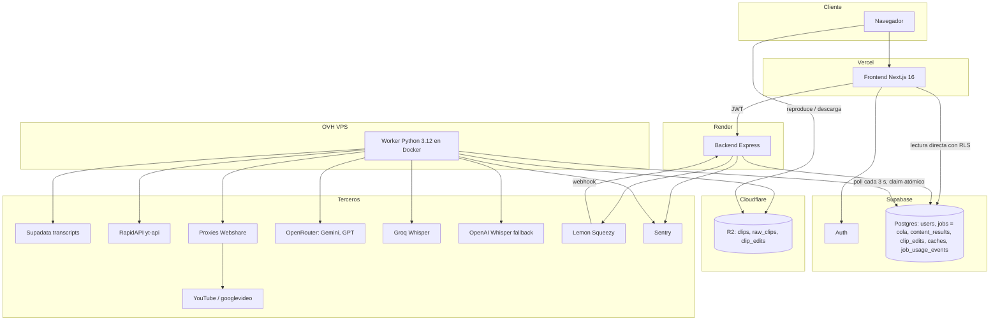
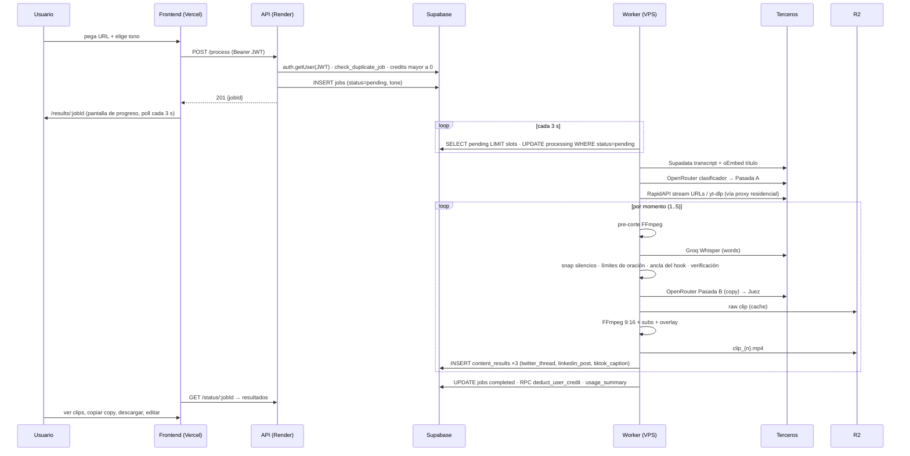

# viral-engine — Documento de entendimiento del proyecto

**Fecha:** 16 de septiembre de 2026 · **Estado del proyecto:** parado desde el 8-jul-2026, arrancando nueva etapa (beta cerrada) · **Autor del código:** Agustín Bolioli (único desarrollador) · **Vocabulario:** [`CONTEXT.md`](../CONTEXT.md) · **Decisiones:** [`docs/adr/`](adr/) · **Guía para agentes:** [`AGENTS.md`](../AGENTS.md) · **Calidad de clips (diagnóstico y plan):** [`PLAN_CALIDAD.md`](PLAN_CALIDAD.md) · **Competencia (Opus Clip, mismo video):** [`ANALISIS_OPUS_CLIP.md`](ANALISIS_OPUS_CLIP.md)

Este documento es la fuente única de entendimiento del proyecto: qué es, para quién, cómo funciona por dentro, en qué estado está y qué se decidió para la próxima etapa. Se escribió leyendo el 100 % del código (≈25 k líneas), las 15 migraciones SQL, los 127 commits y verificando la infraestructura en vivo. Cuando algo del código contradice a la documentación previa, manda el código y se señala.

---

## Índice

1. [Resumen ejecutivo](#1-resumen-ejecutivo)
2. [Producto y negocio](#2-producto-y-negocio)
3. [Mapa conceptual](#3-mapa-conceptual)
4. [Arquitectura](#4-arquitectura)
5. [El worker: pipeline paso a paso](#5-el-worker-pipeline-paso-a-paso)
6. [Capa de IA](#6-capa-de-ia)
7. [Modelo de datos](#7-modelo-de-datos)
8. [API del backend](#8-api-del-backend)
9. [Frontend](#9-frontend)
10. [Infraestructura, deploy y operación](#10-infraestructura-deploy-y-operación)
11. [Configuración](#11-configuración)
12. [Calidad y observabilidad](#12-calidad-y-observabilidad)
13. [Estado actual y hallazgos](#13-estado-actual-y-hallazgos)
14. [Deuda técnica y backlog](#14-deuda-técnica-y-backlog)
15. [Plan de la nueva etapa](#15-plan-de-la-nueva-etapa)
16. [Trabajo con agentes IA](#16-trabajo-con-agentes-ia)
- [Apéndice A — Comandos](#apéndice-a--comandos)
- [Apéndice B — Mapa de archivos](#apéndice-b--mapa-de-archivos)
- [Apéndice C — Cronología](#apéndice-c--cronología)

---

## 1. Resumen ejecutivo

**Qué es.** Un SaaS que recibe un video de YouTube (y, a partir de la nueva etapa, también el archivo del creador) y devuelve de 1 a 5 *momentos virales*: por cada uno, un **clip vertical 9:16** con subtítulos palabra por palabra y un hook de ≤4 palabras quemado en pantalla, más **copy listo para publicar** (hilo de 7 tweets, post de LinkedIn, caption de TikTok) y un **score de viralidad** calibrado por un modelo juez independiente. Incluye un editor post-clip (título, estilo de subtítulos, corrección de palabras, recorte) que re-renderiza el clip.

**Para quién.** Podcasters y coaches hispanohablantes que publican episodios largos y necesitan clips cortos para TikTok/Reels/Shorts sin editar a mano. El clip 9:16 es el valor primario; el copy es secundario.

**Cómo se cobra.** 1 crédito = 1 job. 5 créditos gratis al registrarse; plan Starter US$9/mes = 40 créditos (Lemon Squeezy). Costo de IA medido: ~US$0.18 por job frente a US$0.225 de ingreso por crédito.

**Cómo está hecho.** Tres piezas: frontend Next.js en Vercel, API Express en Render, y un worker Python en un VPS de OVH que hace todo el trabajo pesado (transcript, LLMs, descarga de YouTube, Whisper, FFmpeg, subida a Cloudflare R2). Supabase (Postgres + Auth) es la base de datos **y la cola**: la tabla `jobs` es la cola de trabajo. Diez servicios externos participan en cada job.

**Por qué se paró.** Falta de tiempo y, sobre todo, la fiabilidad de la descarga de YouTube desde un datacenter: con proxies residenciales lentos (30 KB/s) los jobs terminaban "completados" con links a YouTube en vez de clips.

**Estado hoy (verificado el 16-sep-2026).** Frontend publicado; backend vivo en Render free (cold start de 25 s); **Supabase pausado** por inactividad, por lo que el producto está caído end-to-end; VPS encendido pero el worker casi seguro detenido; todas las cuentas de terceros activas. En local (Mac) el proyecto instala y sus tests pasan (backend 27/27, worker 104/104, frontend sin errores de tipos); en GitHub Actions el CI está en rojo desde siempre por variables de entorno faltantes, y el deploy al VPS nunca dependió de él.

**Qué se decidió para la nueva etapa.** Objetivo: **beta cerrada estable** con 5–10 invitados, ~10 h/semana del dueño más agentes IA en paralelo. Decisiones clave: la **subida directa del archivo** pasa a ser el camino garantizado para obtener clips (ADR 0007); los **créditos se reservan al encolar** y se devuelven si el job falla (ADR 0005); un job es exitoso si produce **al menos un clip**; tope de **90 minutos** por video; esquema versionado con **Supabase CLI** (ADR 0006); Render pasa a plan pago; proyecto Supabase **separado para desarrollo**; trabajo en ramas con PR y deploy manual; resolución de clips **720×1280** durante la beta. Métrica de éxito: **≥90 % de los jobs con todos sus clips en <15 min durante 2 semanas**. Plan en cuatro fases (§15).

---

## 2. Producto y negocio

### 2.1 Qué recibe el usuario por cada job

| Entregable | Detalle | De dónde sale |
|---|---|---|
| 1–5 momentos | 1 si el video dura <90 s, 3 si <5 min, 5 si ≥5 min. Cada uno de 10–60 s (ideal 15–55 s), sin solapamiento >50 % | Pasada A (§6) + validadores |
| Clip MP4 9:16 por momento | 720×1280, fondo desenfocado del propio video, subtítulos blancos tipo TikTok sincronizados por palabra, overlay de ≤4 palabras en mayúsculas durante los primeros 3,5 s | FFmpeg en una sola pasada (§5.5) |
| Hilo de Twitter/X | Exactamente 7 tweets de 180–280 caracteres, sin prefijos ni "[Link]" | Pasada B |
| Post de LinkedIn | 800–1200 caracteres, hook de 3 líneas, pregunta final | Pasada B |
| Caption de TikTok | 1–2 líneas coloquiales + 3–4 hashtags | Pasada B |
| Scores | Hook, retención y compartibilidad 1–10 con justificación en texto | Juez (§6) |
| ROI estimado | Minutos "ahorrados": 8 + 0,5 × segundos de clip + 15 × piezas de copy (fórmula fija) | `scorer.py` |
| Metadatos de calidad | `verification_failed`, cobertura de subtítulos, palabras/segundo, flags (`incomplete_tail`, `late_hook`, `clip_not_rendered`…) | Pipeline por clip |
| Editor post-clip | Cambiar overlay y posición, estilo de subtítulos (`tiktok_viral`, `clean`, `podcast`), corregir palabras, resaltar palabras, recortar inicio/fin → nuevo render | Cola `clip_edits` (§5.7) |
| Personalización | Tono del copy (profesional, sarcástico, motivador, casual) elegido por job; nombre y título profesional del creador inyectados en los prompts (sin UI todavía, §13) | `jobs.tone`, `users.display_name/professional_title` |

La landing promete además "Ver demo" (botón sin acción), "usado por miles de creadores" y "videos de cualquier duración": son textos aspiracionales, no funcionalidad.

### 2.2 Cliente objetivo y propuesta de valor

- **ICP confirmado (sep 2026):** podcasters y coaches que hablan español y publican en YouTube. El clasificador del pipeline solo distingue dos categorías, *podcast* (conversación de 2+ personas) y *business* (todo lo demás: monólogos, keynotes, tutoriales), y el copy sale en el idioma del video.
- **Propuesta de valor:** "pegá el link (o subí tu episodio) y en menos de 15 minutos tenés 5 clips verticales subtitulados listos para publicar, con el texto para cada red". El diferencial frente a herramientas gratuitas es la calidad en español del corte (límites de oración, hook al inicio, verificación anti-alucinación) y de los subtítulos.
- **Inglés y otros idiomas:** el pipeline ya sigue el idioma del transcript, pero no se prioriza ni se prueba en esta etapa.

### 2.3 Créditos, planes y facturación

| Concepto | Hoy en el código | Decidido para la nueva etapa |
|---|---|---|
| Alta de usuario | Trigger `handle_new_user` en `auth.users` crea la fila en `public.users` con **5 créditos** | Igual (la página de precios dice "3": corregir) |
| Consumo | Se valida `credits > 0` al encolar; el worker descuenta 1 al completar con el RPC atómico `deduct_user_credit` (registra fila en `transactions`) | **Reservar al encolar, devolver si el job falla** (ADR 0005). Job exitoso = ≥1 clip renderizado |
| Plan Starter | US$9/mes, 40 créditos; Lemon Squeezy: `subscription_created` → plan `starter`, 40 créditos; `subscription_payment_success` (renovación) → resetea a 40; `subscription_updated/cancelled/expired` → plan `free` | Igual; sin cobro real hasta cumplir la métrica de la beta |
| Precio por crédito | `CREDIT_PRICE_USD = 9/40 = 0,225` (usado por el panel admin para margen) | Igual |
| Duplicados | Misma URL completada en los últimos 7 días → 409 | Igual |
| Rate limit | 5 `POST /process` cada 15 min por usuario | Igual |

### 2.4 Economía unitaria (medida en julio de 2026, 1 job de ~30–60 min, 5 clips)

| Componente | Costo por job | Notas |
|---|---|---|
| Clasificador (Gemini 2.5 Flash-Lite) | ~US$0.0001 | 1 llamada |
| Pasada A (Gemini 3.5 Flash, reasoning low) | ~US$0.14 | 1 llamada, 20–50 k tokens de entrada |
| Pasada B (Gemini 3.5 Flash) ×5 | ~US$0.035 | ~US$0.007 por clip |
| Juez (GPT-5.4 nano) ×5 | ~US$0.0014 | |
| Whisper (Groq large-v3-turbo) ×5 | ~US$0.0025 | US$0.04/hora de audio |
| **Total IA** | **~US$0.18** | vs. US$0.225 de ingreso por crédito → ~20 % de margen bruto solo sobre IA |
| No medido por job | Supadata, RapidAPI, proxies Webshare, R2, VPS | Costos fijos mensuales (§10) |

Fuente: `docs/RECOMENDACION_MODELOS_LLM.md` §5 y `job_usage_events`. El panel `/admin/usage` lo muestra en vivo.

### 2.5 Marca y nombre

El producto se llama "ViralEngine" en la interfaz, "YouTube Viral Content Engine" en README y docs, `viral-engine-front` en GitHub y `mvp_p1` en rutas antiguas de Windows. **El nombre definitivo está en discusión**; el nombre de trabajo es `viral-engine`. Atención: `viralengine.app` pertenece a un tercero y la página de precios usa `hola@viralengine.app` como contacto (dominio ajeno): hay que reemplazarlo. La decisión de marca condiciona el dominio propio, que a su vez habilita mover el API al VPS (§15).

---

## 3. Mapa conceptual

El vocabulario canónico vive en [`CONTEXT.md`](../CONTEXT.md). Relaciones entre conceptos:



Reglas de dominio que el código ya aplica o que se decidieron:

- Un job pertenece a un usuario; solo él lo ve (RLS) y solo él puede reintentarlo o borrarlo.
- Un job en `pending`/`processing` no se puede borrar; uno `failed` o `completed` se puede reintentar (vuelve a `pending`, mismo id).
- Un momento sin clip renderizado muestra un link a YouTube con timestamp (degradación explícita).
- **Nuevo:** un job sin ningún clip es `failed` y devuelve el crédito.
- Una edición siempre parte del último borrador guardado; mientras está `queued`/`processing` no se puede volver a encolar.

---

## 4. Arquitectura

### 4.1 Componentes



| Componente | Responsabilidad | No hace |
|---|---|---|
| **Frontend** (`frontend/`) | UI, login (Google OAuth y magic link), dashboard, resultados, editor, precios, cuenta, panel admin. Lee `jobs`, `users`, `content_results` **directo de Supabase** con la anon key y RLS; las mutaciones van por el API | Nada de IA ni de video |
| **Backend** (`backend/`) | Validar JWT, crear jobs, estado, reintentar/borrar, créditos, checkout y webhook de Lemon Squeezy, guardar ediciones y encolarlas, métricas admin | No procesa video; no llama LLMs; no descuenta créditos |
| **Worker** (`worker/`) | Todo el procesamiento: transcript, clasificación, selección, descarga, Whisper, copy, juez, FFmpeg, R2, guardar resultados, descontar crédito, re-renders, métricas de costo | No expone API (solo un `/health` opcional si `PORT` está seteado) |
| **Supabase** | Auth, datos, cola, RPCs (`deduct_user_credit`, `check_duplicate_job`, `get_job_usage_summary`), trigger de alta | — |
| **R2** | Hosting público de MP4 (`{job_id}/clip_{n}.mp4`), cache de segmentos crudos (`raw_clips/{job_id}_{n}.mp4`), clips editados (`clip_edits/{edit_id}.mp4`) | — |

### 4.2 Flujo end-to-end de un job



### 4.3 Decisiones de arquitectura ya registradas

- [ADR 0001](adr/0001-la-tabla-jobs-es-la-cola.md): la tabla `jobs` es la cola (sin Redis).
- [ADR 0002](adr/0002-copy-en-dos-pasadas-desde-el-audio-real.md): el copy se escribe desde el audio real del clip (dos pasadas).
- [ADR 0003](adr/0003-juez-de-scores-de-otra-familia-de-modelos.md): juez de otra familia de modelos.
- [ADR 0004](adr/0004-worker-en-vps-propio-con-proxies-residenciales.md): worker en VPS propio con proxies residenciales; API en Render.

---

## 5. El worker: pipeline paso a paso

Entry point: [`worker/main.py`](../worker/main.py). Documentación previa del autor: [`worker/WORKER.md`](../worker/WORKER.md) (buena, mantenerla alineada con este documento).

### 5.1 Arranque

1. Carga `.env` desde la raíz del repo.
2. Inicializa Sentry solo si `SENTRY_DSN_WORKER` está seteada (**W9-B**: antes tenía un DSN de producción hardcodeado como fallback — mismo fix que F1 ya había hecho en el backend, `SENTRY_DSN_BACKEND`).
3. `setup_logging()`: redirige todos los `print()` a logging con contexto (`job=… m=… phase=…`) y archivos rotativos `worker-logs/worker.log` (20 MB × 5) y `worker-error.log`.
4. `validate_env()`: exige `SUPABASE_URL`, `SUPABASE_SERVICE_KEY`, `OPENROUTER_API_KEY`, `OPENAI_API_KEY`; en `ENVIRONMENT=production` exige además `RAPIDAPI_KEY` y advierte si faltan proxies, Groq, Supadata, R2 o cookies; imprime los modelos LLM resueltos y avisa si alguno es `:free` o Gemini 2.0 (apagado en junio de 2026).
5. `cleanup_old_files()`: borra archivos >24 h en `downloads/` y `clips/`.
6. `recover_stale_jobs()`: jobs en `processing` con `updated_at` >20 min → `failed` ("Worker crashed…").
7. `start_keepalive()`: ping a Supabase cada 45 s (evita cierre de conexión idle). **Efecto colateral útil:** mientras el worker corre, el proyecto Supabase free nunca se pausa por inactividad.
8. `watch_queue()`: loop infinito.

### 5.2 Loop y reclamo de jobs (`watch_queue`)

- `ThreadPoolExecutor(max_workers=MAX_WORKERS)`; default en código 2, en `docker-compose*.yml` 3.
- Cada 3 s (`POLL_INTERVAL`): si hay slots libres, `SELECT id, video_url, user_id, tone FROM jobs WHERE status='pending' ORDER BY created_at LIMIT slots`; por cada uno, `UPDATE jobs SET status='processing' WHERE id=? AND status='pending'`; si el UPDATE no devuelve fila, otro worker lo ganó y se salta.
- Después de los jobs, reclama **como máximo una** edición (`claim_next_clip_edit`) por iteración.
- Timeout por job: dinámico según la duración del video (W14 addendum, `compute_job_timeout_sec`): piso 30 min con la duración aún desconocida, se re-arma apenas se conoce — antes de bajar nada, con `lengthSeconds` del HTML público de la watch page, probado directo y luego por hasta 3 proxies del pool porque a la IP del VPS YouTube le sirve la página de bot sin ese campo (15 min base + 0,6 min por minuto de video, techo 75 min) — `threading.Timer` + `check_timeout()` entre pasos, no mata el hilo, el job sigue hasta el siguiente checkpoint. Antes era un fijo de 30 min; no cerraba para videos largos con el pipeline de Fase 0 (job real 4c6e4410, 21-sep-2026: murió en `evaluating` al minuto 30).
- No hay afinidad de worker: dos workers contra la misma base se reparten los jobs (por eso dev usa su propio proyecto Supabase, §15).

### 5.3 Pasos de un job (`_process_job_inner`)

**Contrato de progreso (W9-B, acordado con la pantalla de progreso nueva — P1, en paralelo sobre `integracion/fase-0`):** `jobs.current_step` es un enum fijo que solo escribe el worker — `transcribing|classifying|analyzing|evaluating|ranking|delivering|finalizing` (`main.JOB_STEPS`); `jobs.progress_percentage` (0-100) lo calcula `main.compute_progress_percentage()` (función pura, testeada en `tests/test_w9b.py`) con rangos fijos por fase (transcript 0-15, análisis 15-25, evaluación 25-70 lineal por candidato, entrega 70-98 lineal por clip, 100 al cerrar) — evaluación y entrega son las únicas fases con progreso fino, porque son las únicas con trabajo por-ítem contable. `jobs.progress_detail` (jsonb, columna de P1; el worker degrada con gracia si todavía no existe) trae `{current, total, message, clips_ready}` en cada candidato evaluado y cada clip entregado. `content_results` se escribe por clip a medida que se entrega (dentro de `_deliver_moment`, en el loop de Step 5b), no al final del job — la galería puede mostrar parciales.

| Paso | `current_step` / progreso | Módulo | Qué pasa |
|---|---|---|---|
| 1–2 Transcript | `transcribing` 0 → 15 | `services/yt_transcript.py` | Fuente según `TRANSCRIPT_SOURCE` (W4, default `supadata`): Supadata (`/v1/youtube/transcript`) → segmentos con timestamps; fallback `youtube-transcript-api` solo fuera de producción. Con `whisper_full` / `hybrid`, Whisper del audio completo (ver el párrafo debajo de la tabla). Metadatos por oEmbed (título, autor; **duración = 0**, se infiere del último segmento + 5 s). Guarda en `transcription_cache` (se lee para el Transcript de W4; para captions sigue sin leerse en el pipeline, §13) |
| 3 Análisis | `classifying`/`analyzing` 15 → 25 | `services/processor.py` | Perfil del usuario (`display_name`, `professional_title`) + tono → `analyze_with_openrouter`: cache `analysis_cache` (clave `video_id + modelo + tono + PROMPT_VERSION=v8`) → clasificador (cache `category_cache`) → transcript compacto (~50 % menos tokens) → **Pasada A** (`moment_selector.py`) → saneo del JSON (json_repair, arrays de 1 elemento, `surgical_clipping` → `start_time/end_time`, `shareability` faltante) → validadores de contenido → `AnalysisResult` (Pydantic) → guarda en cache |
| 3.5 Filtro | — | `services/validation.py` | `validate_durations` (10–60 s; el truncado a 60 s snapea al fin de segmento) · `filter_overlapping_moments` (>50 % → descarta) · `validate_against_transcript` (frases citadas). Si no queda ningún momento, el job falla |
| 4 Descarga | `evaluating` (piso 25, preparación) | `main.py` + `services/downloader.py` | Selector de estrategia (§5.4) y descarga upfront o per-clip. Exige `RAPIDAPI_KEY` en producción |
| 5a Evaluación | `evaluating` 25 → 70, lineal por candidato | `clip_generator.py`, `transcriber.py`, `scorer.py` | Por cada candidato: sub-pipeline §5.5 fase de evaluación |
| 5b Ranking | `ranking` 70 | `moment_selector.py` | `select_finalists` — entrega por umbral (W9-B, §5.5) |
| 5c Entrega | `delivering` 70 → 98, lineal por clip | `clip_generator.py`, `processor.py`, `scorer.py`, `supabase_client.py` | Por cada finalista: sub-pipeline §5.5 fase de entrega (Pasada B, render, `save_content_result`) |
| 6 Cierre | `finalizing` 100 | `supabase_client.py`, `usage_tracker.py` | `_finalize_job_outcome` (W9-B, §5.6) → `usage_summary` → limpieza de archivos |

**Resuelto en W9-B:** antes de esta línea, `current_step` usaba `downloading`/`analyzing`/`generating`/`completed` (con `downloading` repetido para dos pasos distintos) y no coincidía con lo que mostraba la pantalla de progreso del frontend. El enum de la tabla de arriba es el contrato acordado con P1 (pantalla de progreso nueva, en paralelo sobre `integracion/fase-0`).

**Transcript de alta resolución (W4, [`PLAN_CALIDAD.md`](PLAN_CALIDAD.md) §4 y §9; causa C1).** Con `TRANSCRIPT_SOURCE=whisper_full` el paso 1–2 deja de depender de los captions: `downloader.download_audio_only` baja solo el audio (yt-dlp `bestaudio` → stream URL de audio por proxy sticky en el VPS → progresivo mínimo, que es lo único que YouTube ofrece sin cookies: formato 18, 360p, ~5 MB/min), `transcriber.transcribe_full_audio` lo parte con ffmpeg en tramos de 10 min con 5 s de solape y los transcribe con la misma cascada que el clip (Groq `whisper-large-v3-turbo` → OpenAI `whisper-1`, `verbose_json` con palabras, hasta 3 tramos en paralelo; el primero se transcribe solo para fijar el idioma), `merge_chunk_transcripts` une los tramos cortando en la mitad del solape por tiempo (sin reordenar palabras: los tiempos por palabra de Groq tienen jitter) y `transcript_lines.build_full_transcript` produce el Transcript: `words` con puntuación y mayúsculas (Groq las trae en las palabras; lo que falta se pega desde `segments[].text`) y tokens `__silence` con start/end en los huecos ≥ 0,3 s; `lines` = Líneas (oraciones con `start`/`end`/`text`: terminan en `. ? ! …` o en una pausa ≥ 1,5 s; los tramos de ≥ 40 palabras que Whisper dejó sin puntuar se puntúan con el modelo del clasificador, `TRANSCRIPT_PUNCTUATE_FALLBACK`); `wpm`; y `segments` = las Líneas, así que el clasificador, `validate_durations`, `validate_against_transcript` y el prompt de contexto de Whisper ven oraciones enteras sin cambiar de firma. La Pasada A recibe una Línea por renglón, `[inicio-fin] Oración.` en segundos, en vez de los bloques `[s-e]: texto` de captions (un bloque agrupa hasta 30 s de varias oraciones); el resto del prompt no cambia. **Los timestamps van en segundos, no en `mm:ss`:** medido en `podcast_general_01`, con `[mm:ss]` `gemini-3.5-flash` concatena minutos y segundos en vez de convertirlos (la oración de `[57:16]` volvió como `start_time=5716`) en los 8 candidatos y aun con un encabezado que explicaba la conversión, y 2 de 8 quedaban fuera del video; `TRANSCRIPT_LINE_STYLE=mmss` conserva ese formato para probar con otros modelos y `ViralMoment` acepta `"mm:ss"` como red. `hybrid` = captions para el clasificador y las validaciones numéricas + Líneas de Whisper para la Pasada A (ADR 0007). Si el audio no baja o Whisper falla, el job sigue con captions (`source_fallback_from`). Whisper no recibe el título como `prompt`: medido, alucinaba el título, se saltaba los primeros 30 s y devolvía segmentos 3× más largos. Los consumidores de palabras (subtítulos, anclas W1, guardas W3) trabajan sobre la Transcripción del clip, que no trae silencios; cualquier consumidor del Transcript completo debe pasar por `transcript_lines.words_without_silence()`. Medido en `podcast_general_01` (77 min): 27 s de Whisper + ~20 s de puntuación de respaldo, US$0.052 + ~US$0.003, 13.460 palabras, 730 Líneas (98 % terminan en puntuación, 96 % arrancan en mayúscula, mediana 15 palabras / 4,8 s), 464 silencios ≥ 0,3 s (8 % del video), 174 wpm; el prompt de la Pasada A pesa lo mismo que el compacto de captions (80 k vs 79 k chars) con 4× más resolución (730 Líneas vs 176 bloques). Efecto medido en la Pasada A (misma llamada sobre el mismo video, tope de 120 s de W2-B): con Líneas, 6 de 8 candidatos arrancan exactamente en inicio de oración (±1 s) y 4 de 8 terminan en fin de oración, con duraciones de 41–65 s; con captions, 1 de 8 y 1 de 8, con duraciones de 81–192 s (5 de 8 por encima del tope, que `validate_durations` recorta). Es la causa C1 cayendo: el corte todavía lo decide W1 sobre la Transcripción del clip, pero la Pasada A ya propone límites de oración. Con `supadata` (default) nada de esto corre. Usage tracker: eventos `task=transcript_full` (y `punctuate`); cache de la Pasada A separada por fuente (`analysis_cache.effective_prompt_version()`: `v6` / `v6+whisper_full` / `v6+hybrid`). Tests: `tests/test_transcript_full.py`.

### 5.4 Estrategias de descarga de video (el punto crítico)

YouTube bloquea IPs de datacenter; el worker combina cuatro mecanismos: **yt-dlp** (con cascada de `player_client` tv/ios/android/web y cookies opcionales), **RapidAPI yt-api** (devuelve URLs de stream de googlevideo), **proxies residenciales Webshare** (lista en `proxies.txt`; las URLs de googlevideo quedan atadas a la IP que las resolvió, por eso se usa el mismo proxy "sticky" para resolver y descargar) y **Apify** (actor externo, opcional). En producción (`ENVIRONMENT=production` o `USE_RAPIDAPI_DOWNLOAD=true`) se prefiere RapidAPI + proxy.

Selector automático (`_select_download_strategy`, override con `DOWNLOAD_STRATEGY`):

| Estrategia | Cuándo | Qué hace |
|---|---|---|
| `full_ytdlp` | Video ≤30 min, RapidAPI no forzado, hay proxies | yt-dlp baja el video completo con cascada de formatos (720p avc1 → … → `worst`) |
| `upfront_partial` | Clips concentrados en el primer 35 % del video y poco tiempo total de clip | Stream URLs (yt-dlp+proxy o RapidAPI) → descarga secuencial de bytes 0→`max_end` de video y audio (audio completo) → mux FFmpeg → valida frames hasta `max_end`; si el truncado por ratio deja corto el video, re-descarga el stream completo |
| `per_clip_parallel` | Clips dispersos o video largo | yt-dlp `download_ranges` ±8 s de margen de keyframe, 3 en paralelo, un proxy distinto por clip, con presupuesto total `DOWNLOAD_PHASE_BUDGET_SEC=600` |

Si el paso 4 no dejó video listo, cada clip intenta en orden (`_resolve_moment_video_source`): segmento per-clip cacheado → video muxeado → yt-dlp per-clip (rotando proxy en reintentos) → Apify (si `USE_APIFY_FALLBACK`) → stream partial (solo si el clip está en el primer 20 % del video) → **fallback final: link a YouTube con `&t=`** (el momento queda sin MP4). Los tiempos de descarga, MB y clips fallidos se registran como evento `download` en `job_usage_events`.

Perillas: `DOWNLOAD_STRATEGY`, `DOWNLOAD_PARALLEL_WORKERS=3`, `CLIP_MARGIN_BEFORE_SEC=15` / `CLIP_MARGIN_AFTER_SEC=20` (alias legacy `CLIP_KEYFRAME_MARGIN_SEC`), `DOWNLOAD_PHASE_BUDGET_SEC=600`, `CLIP_SYNC_RETRIES=2`, `STRICT_SYNC_VALIDATION=true`, `YTDLP_CLIP_FALLBACK`, `USE_APIFY_FALLBACK` + `APIFY_TOKEN`, `WEBSHARE_PROXY_FILE|LIST|URL`, `YOUTUBE_COOKIES` (base64 o texto Netscape), `RAPIDAPI_KEY`, `USE_RAPIDAPI_DOWNLOAD`.

**No hay tope de duración efectivo:** `validate_video_duration` (2 h) solo se llama desde `download_audio`, un camino legacy que ya no se usa. Se decidió un tope de 90 min para la beta.

### 5.5 Sub-pipeline por momento (el corazón de la calidad)

Desde W1 ([`PLAN_CALIDAD.md`](PLAN_CALIDAD.md) §4) **la verdad son las frases de Verificación** (`first_phrase_in_audio` / `last_phrase_in_audio`, texto real del transcript); `start_time`/`end_time` solo dicen qué descargar. Orden: segmento ancho → Whisper → frases → límites → corte final. Si el momento no trae frases (jobs legacy, prompt sin verificación) corre el flujo numérico anterior (`_refine_bounds_legacy`: snap → oraciones → anclas → duración mínima). **W18:** si el momento sí trae frases pero el anclaje no se pudo hacer (la fuente no cubría el momento o falló el Whisper del segmento ancho), `_refine_bounds_legacy` conserva los límites originales, sin recortes por palabras (el "Head filler trim" le había sacado el planteo a los clips de `fb287cba`), y marca el candidato `hook_not_found`, o sea roto.

**Desde W2 el loop tiene dos fases** (`_process_job_inner` en `main.py`, causas C4/C5 de `PLAN_CALIDAD.md` §1.3). **Desde W9-B** (`PLAN_CALIDAD.md` §9 W9, `docs/adr/0008`) la Pasada A ya no sobre-genera un pool chico para podar: `moment_selector.candidate_count()` pide `min(30, max(6, minutos // 2))` candidatos y **todos** se evalúan de verdad (`rank_and_prune_candidates` ya no trunca, solo anota `candidates_all` con el auto-score). Por cada candidato:

- **Fase de evaluación** (`_prepare_moment_clip`, barata, sin Pasada B ni render): pasos 1-4 de abajo (fuente, Whisper, frases → límites, corte a `precut.mp4`) más un juez (`judge_moment_scores`) sobre el texto real y el hook/overlay de la Pasada A. El `precut.mp4` **no se borra** — si el candidato gana, la entrega lo reutiliza tal cual.
- **Ranking y entrega por umbral** (`moment_selector.select_finalists`): ordena por la suma del juez (nunca por el auto-score — es la causa C4) menos penalizaciones con nombre en tres niveles (W2-C): **fuerte** (`hook_not_found`/`payoff_not_found`/`bad_segment` — el clip no tiene lo que dice tener), **media** (`insufficient`/`timestamps_suspect` — degradación real pero entregable) y **leve** (`late_hook`/`incomplete_tail`/`min_duration_reverted` — informativo, ver §5.5), más `density_out_of_range` fuera de `[1.2, 5.0]` aparte. **Desde W9-B** se entregan TODOS los candidatos usables sin conflicto de diversidad (solapa >30 % en tiempo, o hook casi igual por Jaccard de palabras sin stopwords) cuya nota pase `DELIVERY_JUDGE_MIN` (default 15/30), hasta `DELIVERY_MAX_CLIPS` (default 12, ver §11 por qué no 30); `target_moment_count()` (el 1/3/5 de siempre) y un piso absoluto de 3 (`DELIVERY_MIN_CLIPS`) pasan a ser un **piso mínimo garantizado**: si menos candidatos que `max(target, 3)` pasan el umbral, se completa con los siguientes mejores igual (backfill, ignora diversidad, nunca entrega un candidato sin `clip_text`). **Desde W18 el piso no rellena con rotos** (`is_broken`: `hook_not_found`, `payoff_not_found` o `bad_segment`). Si hay menos entregables que el piso, se entregan menos; con 0, el job falla y devuelve el crédito. El plan de créditos (1/3/5) ya no limita cuántos clips se entregan (ADR 0008) — el techo real es de costo. Las notas de **todos** los candidatos (elegidos y descartados, con el motivo) se anotan en `candidates_all` dentro de `analysis_cache` (W0, sin migración de esquema).
- **Cortacircuitos (W18, `cortacircuitos_motivo` en `main.py`)**: durante la evaluación, si 4 de los primeros 5 candidatos quedan con `hook_not_found`/`payoff_not_found` (o, al terminar, ≥ 50 % del total con un mínimo de 4), el transcript se considera desalineado del audio. El job loguea `CORTACIRCUITOS` con nivel ERROR, purga la caché del video (`services/cache_purge.py`, la misma lógica que el script) y se relanza una sola vez (`_process_job_inner(realign_attempt=1)`, con el timeout contado desde el arranque original y el uso acumulado en el mismo rollup): rehace el transcript con una descarga nueva del audio, la Pasada A y la evaluación. Si se dispara de nuevo, el job termina `failed` con "no pudimos alinear el audio del video con su transcript". `update_job_error` devuelve el crédito (F1) y el failure-watcher manda la alerta. Se dispara antes de `select_finalists`, así que nunca quedan filas en `content_results`.
- **Fase de entrega** (`_deliver_moment`, solo finalistas, renumerados 1..N en orden cronológico — N ya no es un `target` fijo): pasos 6-10 de abajo (Pasada B, juez final post-copy, cache raw, render de **preview**, subida, `save_content_result`). Los candidatos descartados nunca llegan acá: ni Pasada B, ni render, ni fila en `content_results`.

Pasos 1-5 (evaluación) y 6-10 (entrega) del corte por momento:

1. **Fuente y segmento ancho** (`_resolve_moment_video_source` → `_MomentSource` con el rango absoluto disponible): el segmento per-clip se descarga con márgenes asimétricos `CLIP_MARGIN_BEFORE_SEC=15` / `CLIP_MARGIN_AFTER_SEC=20` (`CLIP_KEYFRAME_MARGIN_SEC` sigue como alias que setea ambos); `upfront_partial` descarga hasta `max(end_time) + 20 + 25 s`. Se pre-corta `wide.mp4` = `[start_time − 15, end_time + 20] ∩ disponible` (`cut_clip`, re-encode).
2. **Whisper sobre el segmento ancho** (`_transcribe_with_guards` → `transcriber.py`): extrae audio (loudnorm, 16 kHz mono), prompt de contexto (vocabulario de marca + título + slice del transcript del rango ancho, ≤800 chars; con W4 ese slice son Líneas puntuadas en vez de captions) y **Groq `whisper-large-v3-turbo`** con `timestamp_granularities=[segment, word]`; fallback OpenAI `whisper-1`. Post-proceso: filtra alucinaciones y palabras fuera de rango, ghost words, correcciones fonéticas de marca. Las palabras quedan en la línea de tiempo del segmento ancho. Guardas W3 (`assess_whisper_words`): `bad_segment` → una re-descarga con otro proxy y, si persiste, corte numérico **sin subtítulos**; `timestamps_suspect` → se re-transcribe **una vez con el otro proveedor** (`provider="openai"|"groq"`) y, si el segundo también es sospechoso, corte numérico sin subtítulos + `subs_disabled_timestamps`.
3. **Frases → límites** (`validation.py`, función pura `compute_clip_bounds`): `locate_phrase` (matching fuzzy en orden, sin acentos ni puntuación, tolera 1 de 4 palabras distinta y 2 insertadas; `prefer="first"` para la primera frase, `"last"` para la última buscada **después** de la primera) y `sentence_bounds_around` (retrocede/avanza hasta puntuación, gap >0,6 s o fin de segmento Whisper, con tope de 10 s). Inicio = inicio de oración de la primera frase − 0,25 s; fin = fin de oración de la última + 0,40 s. Si la última no aparece y el segmento no llega al final del video, se **re-descarga una vez con +25 s** (`margin_extended`) y se repite 2–3; si sigue sin aparecer → `payoff_not_found` y el primer fin de oración en o después de `end_time` que deje 15–60 s. Si la primera no aparece → `hook_not_found` y ancla de hook/overlay cerca de `start_time`, o el inicio de oración más cercano ≥ `start_time − 3 s`. Reglas duras: 15–60 s (<15: extender al siguiente fin de oración; >60: mover el inicio al siguiente inicio de oración antes que perder el remate; si igual no entra, cortar al fin de oración ≤60 s y flaggear), nunca arrancar en minúscula si hay un inicio de oración ≤2 s antes. **W1-C** (hallazgo del agente de W4: 6 de 7 clips sin mayúscula inicial arrancaban exactamente una palabra después del inicio de la Línea, porque el modelo cita la frase sin el conector — "Luego", "Para", "Aquí" — y en el segmento ancho no hay puntuación ni gap antes de esa palabra): con Líneas del transcript completo (`TRANSCRIPT_SOURCE=whisper_full|hybrid`, W4), `compute_clip_bounds` alinea el inicio al inicio de la Línea que contiene la primera frase y el fin al fin de la Línea de la última (`evidence["line_aligned"]`, flag `line_aligned` en `clip_quality_issues`) — las Líneas mandan sobre las palabras del segmento ancho para decidir bordes, no para subtítulos ni guardas. Sin Líneas (Supadata, jobs legacy), respaldo barato: si la primera palabra queda en minúscula y la anterior es una partícula inicial frecuente (y/pero/luego/para/aquí/entonces/porque/así/sea) pegada (<0,6 s), retrocede una palabra.
4. **Corte final y verificación**: `cut_clip(wide.mp4, start_rel, end_rel)` → `precut.mp4`; las palabras y segmentos se desplazan y filtran a la línea de tiempo del clip final (0-based, `shift_words_timeline` + `filter_whisper_words`), que es lo que ven los subtítulos, el cache raw y `whisper_words` (el editor sigue funcionando igual). La Verificación pasa **por construcción** cuando ambas frases se localizaron (`whisper_mismatch_first|last` solo si una no apareció); el chequeo textual clásico (primeras/últimas 5 palabras) se loguea como evidencia. **Desde W2-C**, `verification_failed` = SOLO `hook_not_found` o `payoff_not_found` (`services.validation.verification_failed_from_flags`); `late_hook` (ahora en palabras además de segundos, `hook_delay_metrics`/`is_late_hook`) e `incomplete_tail` quedan como flags informativos en `clip_quality_issues`, ya no marcan el badge "⚠ Verificar corte" — antes un candidato bien cortado perdía contra uno peor en el ranking de W2 por señales que no medían un corte roto (ver §9). Métricas: `sub_coverage`, `words_per_sec`.
5. **Reintento de sincronía**: si `sub_coverage < 0,9` y `STRICT_SYNC_VALIDATION`, re-descarga el segmento con otro proxy (hasta `CLIP_SYNC_RETRIES`); `bad_segment` re-descarga **una** vez; la extensión de margen por remate ausente es otra re-descarga como máximo. Un mismatch de frases con buena cobertura **no** re-descarga (indica análisis viejo, no descarga mala).
6. **Pasada B** (`generate_moment_copy_full`): genera hilo, post, caption, hook y overlay definitivos desde el texto Whisper del clip (≤4000 chars), con tono y perfil del creador; `clean_moment` valida (7 tweets, rango de LinkedIn, `[Link]`, prefijos, clichés) y reintenta una vez si falla el conteo/longitud. Si no hay texto de clip, "copy rescue" con el slice del transcript. **Fidelidad (W6, `PLAN_CALIDAD.md` §4):** el prompt recibe además la primera y la última oración del clip (derivadas del propio texto; sin puntuación detectable, ambas caen al texto completo) y exige que el hook sea algo que la persona REALMENTE dice, no una promesa del tema. Tras la respuesta se valida overlay (al menos una palabra sin stopword tiene que estar en los primeros ~8 s, aproximados por cantidad de palabras porque esta función no recibe timestamps por palabra) y hook (cobertura difusa por bolsa de palabras contra el texto completo, sin exigir orden, tolera 1 de 4 palabras sin matchear) con `services/content_validators.py`; si alguno falla se regenera **una** vez con una corrección explícita en el prompt, y si persiste se cae a un fallback determinístico (`derive_overlay_from_text` / primera oración) marcando `overlay_no_fiel` / `hook_no_fiel` en `moment.clip_quality_issues`. **Título (W13, `PLAN_CALIDAD.md` §9 W10; etiquetas del 21-sep-2026):** el prompt pide la afirmación concreta del clip (el dato/número/conclusión), no el tema — prohibidas las fórmulas "La verdad sobre"/"El peligro de"/"Lo que nadie te dice" y equivalentes, máximo 60 caracteres, como máximo un "¡...!". `title_is_valid` (`content_validators.py`) valida las cuatro reglas en el mismo gate de reintento que hook/overlay; si el título sigue sin pasar, cae a `resolve_title_fallback`. Motivación: Agustín rechazó clips publicables por el copy, no por el clip ("los títulos y la descripción no explican de qué hablan"), con el patrón "Tema: ¡La verdad sobre X!" repetido en la salida real. **Cascada de fallback (W13-B):** revisar 5 clips reales mostró que "primera oración a secas" podía devolver un fragmento de diálogo roto ("si es un poco exagerado, me cuentes un poquito.") — peor que el genérico que reemplazaba. `resolve_title_fallback` prueba, en orden, quedándose con el primero usable: (a) el hook de la Pasada B si es fiel (W6) y entra en 60 caracteres — ya es texto real y validado; (b) la primera oración del clip, solo si `parece_titulo` (arranca en mayúscula, ≥4 palabras, no arranca con un conector/muletilla suelto — si/y/pero/porque/entonces/o sea/eh/que/cuando/aunque —, no es una pregunta cortada); (c) la oración con más carga informativa (números y palabras de contenido >3 letras, proxy sin POS tagger) entre las primeras 5 que pase el mismo filtro; (d) el `viral_overlay` capitalizado, o "Momento destacado" como último recurso.
7. **Juez** (`judge_moment_scores`): puntúa el texto real del clip + overlay + hook contra una rúbrica con anclas; devuelve `hook/retention/shareability/reasoning` (sin truncar — se muestra completo en la UI como "Por qué este score", W7). Si falla, quedan los scores de la Pasada A (`score_llm`).
8. **Cache de raw clip**: sube `precut/snapped.mp4` a `raw_clips/{job}_{n}.mp4` y guarda `whisper_words` para que el editor re-renderice sin volver a YouTube ni a Whisper ("Plan C").
9. **Render final** (`generate_clip`, una sola llamada FFmpeg): recorte a 9:16 según el **Encuadre** elegido (ver más abajo) → filtro `ass=` de subtítulos → filtro `ass=` del overlay (5 s, arriba) → `libx264 veryfast`, `aac 128k`, `+faststart`. Valida dimensiones. **Desde W9-B** (`PLAN_CALIDAD.md` §9 W9) lo que se entrega de entrada es un **Preview** liviano: `PREVIEW_WIDTH×PREVIEW_HEIGHT` (default 480×854) a `PREVIEW_CRF` (default 28, más compresión) en vez de 720×1280/23 — con más clips entregados por job (ya no 1/3/5), renderizar el HD de todos de una sería demasiado tiempo/CPU. El HD real (720×1280/23, sin cambios) se genera a pedido (ver paso siguiente y §5.7).
   **Encuadre — Split/Fill/Fit** (W5, `docs/PLAN_CALIDAD.md` §9 Fase 1 fila D; motivación `docs/ANALISIS_OPUS_CLIP.md` §2.5, §4 punto 3 — "la diferencia visual más grande de la captura" era el 16:9 original flotando sobre fondo desenfocado, con las dos caras diminutas, contra Opus apilando las dos caras a pantalla completa): `services/reframe.py` (módulo aislado) detecta cortes de cámara (`detect_scenes`, PySceneDetect `ContentDetector`, fallback a una sola escena si la librería falla) y muestrea 5 frames de la escena más larga del clip (`analyze_scene`) con OpenCV YuNet (`worker/models/face_detection_yunet_2023mar.onnx`, licencia Apache-2.0) para encontrar caras **estables** (en ≥3 de 5 muestras, agrupadas por posición) y una heurística de panel de videollamada (dos mitades de brillo distinto separadas por una costura de alto contraste). `choose_layout` (puro) decide: **Split** (2 caras en mitades distintas, o panel detectado) → cada cara recortada a ~40-55 % del ancho original y apilada a pantalla completa (640 px de alto cada una en 720×1280); **Fill** (1 cara estable) → recorte 9:16 centrado en la cara, con la cara al ~38 % de la altura; **Fit** (0 caras, 3+, o sin condiciones claras) → el fondo desenfocado de siempre, sin cambios. Un solo layout por clip (no por escena — alcance acotado V1, sin seguimiento cuadro a cuadro, sin hablante activo, sin detección de paneles por YOLOX). Se arma en la MISMA pasada de FFmpeg, sin renders extra (`clip_generator._build_reframe_filter`). En Split, los subtítulos `tiktok_viral_v2` se corren de ~58 % de altura a la costura (50 %) para no tapar ninguna de las dos caras. Activación: variable de entorno `REFRAME_MODE=off|auto` (default `off`, ver §11) — con `auto`, el análisis corre una vez por clip sobre el segmento ya descargado (≤ ~1,3 s de CPU medido en la validación, muy por debajo del presupuesto de 10 s).
   **Subtítulos — estilo `tiktok_viral_v2`** (default desde W11, `docs/PLAN_CALIDAD.md` §9 Fase 1; motivación `docs/ANALISIS_OPUS_CLIP.md` §2.5): `group_words_v2` agrupa las palabras de Whisper en bloques de 1-3 (nunca deja una partícula española sola al final de un bloque; corta siempre en puntuación fuerte `.!?…` y en gaps ≥0,35 s), `_v2_blocks_with_timing` funde bloques que quedarían visibles <0,25 s y nunca estira un bloque hacia un hueco de silencio ≥0,5 s (sin texto en silencios), `detect_keywords_v2` resalta 1-2 palabras por bloque (verde `#04F827` primario, amarillo `#FFFD03` secundario) usando `moment.keywords` de la Pasada B si vino, o una heurística local si no (números, MAYÚSCULA que no arranca el bloque, ≥7 letras sin ser partícula). Texto en MAYÚSCULAS, fuente cómic **Bangers** (Google Fonts, licencia OFL, embebida en `worker/fonts/` y pasada a FFmpeg como `fontsdir` del filtro `ass=` — no se instala a nivel sistema), animación "pop" (escala 100→112→100 % en 120 ms) al aparecer cada bloque. `tiktok_viral`, `clean` y `podcast` siguen disponibles sin cambios (el editor puede elegirlos vía `subtitle_style` en `clip_edits`).
   **Overlay (hook)** — estilo `tiktok_viral` (default) pasa a caja blanca con texto negro y esquinas redondeadas simuladas (borde grueso del color de fondo en vez de un box real), fuente normal negrita (Liberation Sans, no la cómic), ~73 % del ancho, arriba de los subtítulos sin solaparse; `question` y `stat` sin cambios.
   Estilos disponibles: subtítulos `tiktok_viral_v2|tiktok_viral|clean|podcast`, overlay `tiktok_viral|question|stat`, posición `top|center|bottom`, encuadre `split|fill|fit` (automático vía `REFRAME_MODE=auto`; sin variable u override manual, siempre `fit`).
10. **Subida y persistencia**: `upload_clip_to_storage` → `{job_id}/clip_{n}.mp4` en R2 (el Preview, desde W9-B) → `save_content_result` ×3 (una fila por tipo de pieza: `twitter_thread`, `linkedin_post`, `tiktok_caption`) **repitiendo en cada fila** todos los metadatos del momento (clip_url, `preview_url` —mismo archivo que `clip_url`, W9-B—, tiempos, hook, scores, overlay, raw_clip_url, whisper_words, métricas de calidad). Si faltan columnas de calidad (migración `ai_quality` sin correr) o `preview_url` (migración `galeria_hd` sin correr), reintenta sin ellas.
11. **Degradación**: cualquier excepción en el clip → `clip_url = https://www.youtube.com/watch?v=…&t=Ns`, `clip_generation_error`, flags `clip_not_rendered`; el copy se genera igual ("rescue"). Los scores mostrados solo son los del juez, o los de la Pasada A si el clip se renderizó; sin clip y sin juez no se muestran scores inflados.
    Guardas de sanidad sobre Whisper (`assess_whisper_words`, `enforce_min_duration`; PLAN_CALIDAD §4 W3), persistidas en `clip_quality_issues`:
    - `timestamps_suspect`: el texto Whisper tiene densidad normal pero los tiempos están comprimidos (>5 palabras/s sobre el tramo con habla, o hueco inicial >40 % del clip con ≥1,5 palabras/s). El snap por silencio y el refinamiento se omiten y el clip queda entero (antes: 33 s → 9 s con 72 palabras).
    - `bad_segment`: el segmento descargado no tiene habla plausible (<1,2 palabras/s, <8 palabras únicas, <35 % de palabras únicas o una secuencia de ≥4 palabras repetida que cubre >40 % del texto). Se re-descarga **una** vez con otro proxy/estrategia; si persiste, el clip se renderiza **sin subtítulos** y con el flag (antes: "O R m Y TleK E" se entregaba sin aviso).
    - `min_duration_reverted`: snap + oraciones + anclas dejaron el clip <15 s; se vuelve al último conjunto de límites que cumplía (o a los originales).
    Cortes anclados a frases (`compute_clip_bounds`, W1):
    - `hook_not_found`: `first_phrase_in_audio` no apareció en el segmento ancho (o quedó afuera al mover el inicio para respetar 60 s); el inicio salió de la ancla de hook o de `start_time − 3 s`.
    - `payoff_not_found`: `last_phrase_in_audio` no apareció ni tras extender el margen, o no entró en los 60 s; el fin es un fin de oración de respaldo.
    - `margin_extended`: se re-descargó el segmento con +25 s al final para buscar la última frase.
    - `subs_disabled_timestamps`: Groq y OpenAI dieron timestamps sospechosos; el clip se renderizó sin subtítulos y con corte numérico.
    Fidelidad de copy (`generate_moment_copy_full`, W6), guardadas en `moment.clip_quality_issues`:
    - `overlay_no_fiel`: el overlay no tenía ninguna palabra con carga semántica en los primeros ~8 s del clip ni tras regenerar una vez; se reemplazó por un overlay derivado del texto real.
    - `hook_no_fiel`: menos del 75% de las palabras del hook aparecían entre las del clip (bolsa de palabras) ni tras regenerar una vez; se reemplazó por la primera oración real.
    - `titulo_de_respaldo` (W13-B): el título no pasó las 4 reglas de `title_is_valid` ni tras regenerar una vez, pero `resolve_title_fallback` encontró una fuente real (hook fiel, primera oración, u oración más informativa de las primeras 5) — no es lo mismo "no encontré título" que "usé el hook".
    - `titulo_generico` (W13/W13-B): igual que arriba, pero ninguna fuente real sirvió (ni hook fiel, ni ninguna oración parece un título, ni overlay) — se cae a "Momento destacado".
    `generate_moment_copy_full` los deja en `moment.clip_quality_issues`; `main.py` los mergea con la lista local (`build_clip_quality_issues(...)`) antes de `save_content_result`, así que llegan igual a `content_results.clip_quality_issues`.

### 5.6 Cierre del job

`update_job_progress(completed, 100)` → `_finalize_job_outcome` (W9-B, `docs/PLAN_CALIDAD.md` §9 W9): con al menos un clip MP4 real, `update_job_status(completed)` + `deduct_credit` (no-op si F1 ya descontó al reservar, `credit_reserved`); con **0 clips MP4 y sin excepción**, `update_job_error("sin clips viables")` — dispara `release_credit_on_job_failed` (F1, `supabase/migrations/20260919040620_creditos_reservados.sql`), que devuelve la reserva. Antes de W9-B, un job con 0 MP4 quedaba `completed` igual y consumía crédito (CONTEXT.md define "Job" exitoso como "al menos un momento con clip"; ver §13 hallazgo 2). Después: `finalize_job_usage` (rollup en `jobs.usage_summary`) → limpieza (`cleanup_all`, `cleanup_clips`).

### 5.7 Cola secundaria: ediciones (`clip_edit_processor.py`)

1. Frontend guarda un borrador en `clip_edits` (`POST /api/clips/:id/edit`, status `draft`) y pide `POST /api/clips/:id/regenerate` → `queued`.
2. El worker reclama la más antigua (`queued` → `processing`), resuelve `content_result` y `job`, y obtiene el segmento: **cache R2** (`raw_clip_url` o `raw_clips/{job}_{n}.mp4` vía S3) → stream partial RapidAPI (solo clips tempranos) → yt-dlp `download_ranges` → stream partial.
3. Palabras: `whisper_words` cacheadas (con lógica para raw pre-snap vs post-snap y jobs legacy) o Whisper de nuevo.
4. Aplica `word_corrections` (por timestamp con tolerancia 0,05 s, fallback por índice) y `word_styles` (ASS por palabra: `default|highlight|emphasis`, color), `trim_start_offset`/`trim_end_offset`, `overlay_text`, `overlay_position`, `subtitle_style`.
5. `generate_clip` a 720×1280 → `clip_edits/{edit_id}.mp4` → `completed` + `rendered_clip_url`; el frontend reemplaza el clip mostrado. Errores → `failed` + `error_message`. `music_track_id` existe en la tabla pero la música de fondo es un placeholder "en desarrollo".

**HD a pedido (`edit_type='hd_upgrade'`, W9-A + W9-B, `docs/adr/0008`):** usa el MISMO pipeline que un edit de estilo (mismo 720×1280 del punto 5) — `POST /api/clips/:id/hd` (backend) encola un `clip_edits` con `edit_type='hd_upgrade'` en vez de `'style'`; `hd_url`/`hd_status` que lee `GET /status` se derivan de esa fila (`rendered_clip_url`/`status`), no son columnas nuevas. Antes de W9-B esto no era una mejora real de calidad (el original ya se entregaba en 720×1280); con el **Preview** de 480×854 (paso 9 de §5.5), ahora sí sube la resolución. Idempotencia: si la fila ya tiene `rendered_clip_url` (completada), `process_clip_edit` no vuelve a descargar/renderizar — marca `completed` con esa URL y corta (red de seguridad extra sobre la idempotencia que ya tiene `POST /api/clips/:id/hd` a nivel API).

### 5.8 Caches

| Cache | Dónde | Clave | Ahorra | Estado |
|---|---|---|---|---|
| Transcript (captions) | `transcription_cache` | `video_id` (solo captions; desde W18 un `whisper_full` nunca se escribe acá y de un `hybrid` se guardan solo sus captions) | Llamada a Supadata | **Se escribe pero no se lee** en el pipeline (solo en `eval/`) |
| Transcript completo (W4) | `transcription_cache` + copia local `downloads/{video_id}_transcript_{fuente}_{modelo}.json` | `video_id:whisper_full:whisper-large-v3-turbo` (clave compuesta en la columna `video_id`, sin migración) | Descarga de audio + Whisper (~US$0.05 y ~1 min por 77 min) | Activo: se lee antes de transcribir (`transcript_cache.get_cached_transcript(video_id, source, model)`). **W18:** la copia local se usa solo si Supabase no se pudo consultar (error o sin cliente); si responde sin fila, la copia se ignora y se borra. Con `TRANSCRIPT_LANGUAGE`, un transcript cacheado cuyo idioma dominante (por mayoría de palabras funcionales) es otro se descarta y se recalcula |
| Análisis | `analysis_cache` | `video_id + model + tone + prompt_version`. `prompt_version` lleva el sufijo `+whisper_full` / `+hybrid` según la fuente (W4) y los flags que cambian la Pasada A, ordenados (`effective_prompt_version(source, flags)`, W18; hoy ninguno). En dos pasadas `tone` es el centinela `_pasada_a`, compartido entre tonos; el mega-prompt legacy guarda el tono real (W18) | Pasada A (~30–60 s y ~US$0.14) | Activo. **W18:** `result._transcript_fingerprint` guarda la Huella del transcript y el análisis solo se reutiliza si coincide. Sin huella (filas viejas) o con otra, se recalcula y el upsert pisa la fila. Invalidar subiendo `PROMPT_VERSION` en `analysis_cache.py` o con los scripts de abajo |
| Categoría | `category_cache` | `video_id + model` | Clasificador | Activo |
| Raw clip + words | R2 `raw_clips/` + `content_results.raw_clip_url/whisper_words` | por momento | Re-descarga y Whisper en ediciones | Activo |

**Huella del transcript (W18):** `transcript_cache.transcript_fingerprint(t)` = `fuente|modelo|idioma|pista|sha1-16` del texto y el inicio (0,1 s) de cada Línea (o segmento). Es determinística (sin fechas ni orden de claves); en captions el modelo y la pista van vacíos. `save_transcript` la guarda en el JSON (`fingerprint`), en Supabase y en la copia local.

**Purga por video (W18):** `worker/scripts/purge-video-cache.py <video_id> [--dry-run]` (en el VPS: `docker compose -f docker-compose.worker.yml exec worker python scripts/purge-video-cache.py <id> --dry-run`) borra `analysis_cache`, `category_cache`, `transcription_cache` (clave pelada y compuestas `<id>:%`) y los archivos `downloads/<id>*` (transcripts, audio, restos de descargas), e imprime qué borró. Con `--dry-run` solo lista. La misma función (`services/cache_purge.py`) la usa el Cortacircuitos (§5.5). `invalidate-analysis-cache.py` sigue existiendo y solo borra `analysis_cache`.

### 5.9 Medición de uso y costo (`usage_tracker.py`, `pricing.py`, `context/job_context.py`)

Cada llamada LLM (vía `log_llm_usage`), cada Whisper, cada fase de descarga y cada cache hit inserta una fila en `job_usage_events` (task, modelo, proveedor, tokens de entrada/salida/razonamiento, segundos de audio, costo estimado con la tabla de precios de `pricing.py` —override con `PRICING_OVERRIDES_JSON`—, latencia, `moment_index`, metadata). Al terminar el job se escribe el rollup en `jobs.usage_summary`. `PERSIST_USAGE_EVENTS=false` lo apaga. El contexto (job, usuario, momento, edición) viaja por `contextvars`, así que las ediciones también se atribuyen al job padre.

### 5.10 Constantes y límites

| Constante | Valor | Dónde |
|---|---|---|
| Poll de la cola | 3 s | `main.py` |
| Timeout por job | dinámico: piso 30 min, 15 min + 0,6 min/min de video, techo 75 min (W14 addendum) | `main.py::compute_job_timeout_sec` |
| Job zombie | `processing` >20 min al arrancar → `failed` | `main.py` |
| Limpieza de archivos | >24 h | `main.py` |
| Momentos finales | 1 / 3 / 5 según duración | `moment_selector.py` |
| Candidatos Pasada A | `min(12, minutos)`, al menos target+1 | `moment_selector.py` |
| Duración de momento | 10–60 s | `validation.py` |
| Solapamiento máximo | 50 % (el prompt pide 20 %) | `validation.py` |
| Resolución de clip | 720×1280 | `main.py`, `clip_edit_processor.py` |
| Overlay | 3,5 s, arriba, ≤4 palabras | `clip_generator.py` |
| Whisper por trozos | audio >20 min, trozos de 2 min | `transcriber.py` |
| Transcript completo (W4) | tramos de 10 min + 5 s de solape, ≤3 en paralelo; silencio ≥ 0,3 s; Línea cierra en `. ? ! …` o pausa ≥ 1,5 s; respaldo de puntuación en tramos ≥ 40 palabras | `transcriber.py`, `transcript_lines.py` |
| Presupuesto de descarga | 600 s | env |
| Memoria del contenedor | 10 GB | `docker-compose*.yml` |
| Tope de duración de video | **ninguno** (2 h solo en código legacy) | — |

---

## 6. Capa de IA

Detalle completo en [`docs/INFORME_LLMS.md`](INFORME_LLMS.md) y [`docs/RECOMENDACION_MODELOS_LLM.md`](RECOMENDACION_MODELOS_LLM.md). Configuración central en [`worker/config/model_tiers.py`](../worker/config/model_tiers.py) y [`worker/config/llm_chat.py`](../worker/config/llm_chat.py). Todas las llamadas de chat van por **OpenRouter** con el SDK de OpenAI.

| Tarea | Env | Default (jul 2026) | Temperatura | `max_tokens` | Reasoning | Llamadas/job | Cache |
|---|---|---|---|---|---|---|---|
| Clasificador | `MODEL_CLASSIFIER` | `google/gemini-2.5-flash-lite` | 0.0 | 5 | — | 1 | `category_cache` |
| Pasada A | `MODEL_ANALYSIS` (legacy `OPENROUTER_MODEL`) | `google/gemini-3.5-flash` | omitida (Gemini 3.x) | 16000 | `low` | 1 | `analysis_cache` |
| Pasada B | `MODEL_COPY_WRITING` / `MODEL_COPY` | `google/gemini-3.5-flash` | omitida | 4000 | `minimal` | ~5 (+reintentos) | no |
| Juez | `MODEL_JUDGE` | `openai/gpt-5.4-nano` | omitida (GPT-5.x) | 400 | `none` | ~5 | no |
| Whisper | `GROQ_API_KEY` → `OPENAI_API_KEY` | `whisper-large-v3-turbo` → `whisper-1` | — | — | — | ~5 | `whisper_words` (solo ediciones) |

- Override de reasoning por tarea: `MODEL_{ANALYSIS|COPY|JUDGE}_REASONING`. Gemini 3.x y GPT-5.x razonan por defecto y los tokens de razonamiento consumen `max_tokens` (por eso Pasada A subió a 16000).
- Prompts: Pasada A en `moment_selector.py` (podcast vs business); mega-prompt legacy en `processor.get_dynamic_prompt` (+ `podcast_prompt.py`, `category_prompts.py` para entertainment, apagado salvo `ENABLE_ENTERTAINMENT_CATEGORY=true`); Pasada B en `processor.generate_moment_copy_full`; juez en `scorer.py`. Todos fuerzan el idioma de salida al del transcript (`output_language_instruction`).
- `PROMPT_VERSION = "v4"` en `analysis_cache.py`: subirlo invalida el cache de análisis. Hay que subirlo cada vez que cambian prompts o el modelo de la Pasada A.
- `TWO_PASS_ANALYSIS=false` fuerza el mega-prompt legacy; `COMPACT_TRANSCRIPT=false` desactiva el transcript compacto.
- **Riesgo:** los proveedores retiran modelos con poco aviso (Gemini 2.0 se apagó el 1-jun-2026 y el clasificador cayó en silencio al fallback de keywords hasta julio). Verificar los ids en OpenRouter al reactivar y correr el golden set.

### Golden set (`worker/eval/`)

`run_golden_set.py --tier smoke|analysis|full` sobre `golden_set.json` (4 videos habilitados: business ES, podcast, un video de regresión "claude_hacks", etc.). Métricas: `category_accuracy`, `duration_pass_rate`, `phrase_anchor_pass_rate` (clave), `copy_clean_rate`, `judge_llm_delta_avg`, `judge_response_rate`, con umbrales por tier; sale con código 1 si no se cumplen. **Nunca se corrió un baseline.** Requiere `OPENROUTER_API_KEY`, `SUPABASE_*` y (tier `full`) Groq/OpenAI.

---

## 7. Modelo de datos

Postgres en Supabase. **El esquema base no está versionado** (las tablas `users`, `jobs`, `content_results`, `transactions` se crearon a mano); solo existen las migraciones incrementales `supabase_migration_*.sql` en la raíz, que se ejecutaron manualmente en el SQL Editor. Se decidió adoptar Supabase CLI (ADR 0006). Columnas reconstruidas desde el código:

| Tabla | Columnas relevantes | Notas |
|---|---|---|
| `users` | `id` (= `auth.users.id`), `email`, `name`, `avatar_url`, `credits` (default 5 vía trigger), `subscription_status` (`free|basic|pro|active|canceled|cancelled|expired|unpaid|paused`), `plan` (`free|starter`), `billing_subscription_id`, `display_name`, `professional_title` | Trigger `on_auth_user_created` → `handle_new_user()`. RLS: el usuario ve y edita solo su fila |
| `jobs` | `id` (uuid), `user_id`, `video_url`, `video_title`, `status` (`pending|processing|completed|failed`), `error_message`, `current_step`, `progress_percentage`, `progress_detail` (jsonb, nullable — **P1 + W9-B**: `{current, total, message, clips_ready}`; columna de P1, el worker (W9-B) ya la escribe en cada paso con degradación grácil si no existe), `tone`, `usage_summary` (jsonb), `credit_reserved` (bool, default `false` — **F1/ADR 0005**: `true` si `POST /process`/`retry` ya reservó el crédito de este job), `failure_alert_sent` (bool, default `false` — **F1**: si ya se avisó por Telegram que este job falló), `created_at`, `updated_at` | **Es la cola.** Índices por status y current_step. RLS: select/insert/update propios. **F1:** trigger `trg_release_credit_on_job_failed` (`BEFORE UPDATE`) libera el crédito y pone `credit_reserved=false` cuando `status` pasa a `failed`. **P1 + W9-B — contrato de `current_step`** (TEXT libre, sin CHECK a propósito — un paso nuevo del worker no debe romper jobs en curso): `transcribing \| classifying \| analyzing \| evaluating \| ranking \| delivering \| finalizing` (más `completed`/`failed` en `status`), §5.3. `progress_percentage` lo calcula el worker con una función pura (`main.compute_progress_percentage`, testeada): transcript 0–15, análisis 15–25, evaluación 25–70 lineal por candidato, entrega 70–98 lineal por Clip, 100 al terminar |
| `content_results` | `id`, `job_id`, `type` (`twitter_thread|linkedin_post|tiktok_caption|short_video_script`…), `content`, `clip_url`, `preview_url` (**W9-B**, `docs/PLAN_CALIDAD.md` §9 W9 — mismo archivo que `clip_url`; el worker la llena en todo job nuevo desde esta línea, `null` en jobs viejos), `start_time`, `end_time`, `hook`, `emotional_trigger`, `moment_index`, `pillar_type`, `score_hook/retention/shareability`, `sentiment_detected`, `roi_time_saved`, `score_justifications`, `viral_overlay`, `raw_clip_url`, `whisper_words` (jsonb), `score_llm`, `score_judge`, `verification_failed`, `sub_coverage`, `words_per_sec`, `clip_quality_issues`, `clip_generation_error`, `title`, `description`, `hashtags` (`text[]`; **W10**, `docs/PLAN_CALIDAD.md` §9 Fase 0 — copy por clip: título ≤60 chars, descripción de 2 oraciones, 10 hashtags con "#"), `created_at` | Ya no son necesariamente 5 filas de momento por job (**W9-B**: se entrega por umbral, hasta `DELIVERY_MAX_CLIPS`) — cada momento entregado sigue siendo 3 filas (una por tipo de pieza) con los metadatos repetidos; el frontend agrupa por `moment_index`. Mezcla los conceptos Momento y Pieza de copy: deuda (§14). RLS: select si el job es del usuario |
| `transactions` | `user_id`, `type` (`usage`), `credits` (−1), `description` | Solo la escribe el RPC `deduct_user_credit`. RLS: select propios |
| `transcription_cache` | `video_id` (PK), `transcript` (jsonb), `language`, `duration_seconds` | Se escribe, no se lee |
| `analysis_cache` | `video_id`, `model`, `tone`, `prompt_version`, `result` (jsonb), `category_detected`, `prompt_chars`; unique sobre los 4 primeros | |
| `category_cache` | `video_id`, `model`, `category`; PK compuesta | |
| `clip_edits` | `id`, `content_result_id` (FK cascade), `user_id`, `overlay_text`, `overlay_position`, `subtitle_style` (`tiktok_viral_v2|tiktok_viral|clean|podcast` — `tiktok_viral_v2` habilitado en el CHECK desde W11, migración `20260918230146_subtitulos_v2_check.sql`; el frontend todavía no lo ofrece, ver §9), `overlay_style`, `word_corrections` (jsonb), `word_styles` (jsonb), `trim_start_offset`, `trim_end_offset`, `music_track_id`, `status` (`draft|queued|processing|completed|failed`), `rendered_clip_url`, `error_message` | Cola secundaria. Sin políticas RLS para usuarios (solo service role) |
| `job_usage_events` | `job_id` (FK cascade), `user_id`, `event_type`, `provider`, `task`, `model`, `moment_index`, `input_tokens`, `output_tokens`, `reasoning_tokens`, `audio_seconds`, `estimated_cost_usd`, `cache_hit`, `latency_ms`, `metadata` | RLS activo sin políticas → solo service role. RPC `get_job_usage_summary` |
| `clip_feedback` | `id`, `content_result_id` (FK cascade a `content_results`), `user_id`, `posteable` (bool), `motivo` (`arranca_mal|termina_mal|momento_flojo|subtitulos_mal|se_ve_mal|copy_malo|otro`, nullable), `comentario`, `created_at` | **W7** (`docs/PLAN_CALIDAD.md` §2): etiqueta humana "¿lo publicarías tal cual?", fuente de verdad de calidad contra la que se calibra `score_judge`. Un usuario puede re-etiquetar el mismo clip (se guarda historial completo; API/UI se quedan con la fila más reciente). Índices por `content_result_id` y `user_id`. RLS: el usuario inserta y ve solo sus filas (`auth.uid() = user_id`); sin policy de update/delete |

RPCs: `deduct_user_credit(p_user_id, p_job_id, p_description)` (**F1**: redefinida — no-op si `jobs.credit_reserved=true`, el worker la sigue llamando sin cambios al completar), `reserve_credit(p_user_id)` / `release_credit(p_user_id)` (**F1/ADR 0005**, atómicas, usadas por `POST /process` y `POST /jobs/:id/retry`), `check_duplicate_job(p_user_id, p_video_url, p_days_back)`, `get_job_usage_summary(p_job_id)`. Accesos: el frontend usa la **anon key + RLS** (lee `jobs`, `users`, `content_results`); backend y worker usan la **service role key** (bypass RLS). Backend y worker requieren Supabase; el antiguo fallback a SQLite se eliminó en la limpieza del 16-sep-2026.

---

## 8. API del backend

Express en `backend/src/app.js` (helmet, compression, CORS restringido a `localhost:3000/3001`, `FRONTEND_URL` y `*.vercel.app`, `express.json` con `rawBody` para el webhook), logging Winston (JSON en producción + archivos `logs/`), Sentry (`tracesSampleRate 0.2`, **F1:** solo se inicializa si `SENTRY_DSN_BACKEND` está seteada — antes tenía un DSN de producción hardcodeado como fallback). Auth: `requireAuth` verifica el JWT con `supabase.auth.getUser(token)` y **sobrescribe `req.body.userId`** con el id verificado; `optionalAuth` lo intenta sin bloquear. Admin: allowlist `ADMIN_USER_IDS` / `ADMIN_EMAILS`. **F1:** `backend/src/lib/failure-watcher.js` arranca al importar `app.js` (no en tests) — poll cada 60s de jobs `failed` sin alertar todavía, dispara Telegram (`lib/telegram.js`).

| Método y ruta | Auth | Qué hace |
|---|---|---|
| `GET /` | — | Nombre y versión |
| `GET /health` | — | Readiness: comprueba Supabase (`jobs`) y cuenta `pending`; 503 si falla |
| `GET /health/live` | — | Liveness (Docker/Render) |
| `POST /process` `{videoUrl, tone?}` | JWT + rate limit 5/15 min | Valida regex de YouTube (`watch?v=`, `youtu.be/`, `shorts/`), tono, duplicado (7 días, `409`). **F1 (ADR 0005):** tope de duración — `lib/youtube-duration.js` estima los minutos sin API key (scraping del HTML público, fail-open); si supera `MAX_VIDEO_MINUTES` (default 90) → `400 {error:'Video too long', message}`. El worker vuelve a aplicar el tope con la duración real (W20, default 150, §11). Reserva 1 crédito vía RPC `reserve_credit` (`402` si no hay — y alerta Telegram si el usuario ya tenía jobs previos); inserta job `pending` con `credit_reserved=true` (`201 {jobId}`); si el insert falla después de reservar, libera el crédito |
| `GET /status/:jobId` | opcional | Job + `content_results` ordenados por `moment_index`. Dueño obligatorio si el job tiene `user_id`; jobs sin dueño son públicos. **W10:** cada fila trae además `score_display` (entero 60-99, `null` sin juez) y `grades` (`{hook,retention,shareability}` con letra A-D) — curvados por `backend/src/lib/score-curve.js` sobre el ranking del juez dentro de ese job, calculado al leer, no persistido; es "Score visible" (`CONTEXT.md`), el juez interno (`score_judge`) y el ranking del pipeline no cambian. **W9-A (docs/adr/0008):** cada fila trae además `preview_url` (columna real; **W9-B** la llena en todo job nuevo, mismo archivo que `clip_url` — `null` solo en jobs viejos, pre-W9-B), `hd_url` y `hd_status` (`none\|queued\|processing\|ready\|error`) — estos dos NO son columnas: se derivan al leer del último `clip_edits` de `edit_type='hd_upgrade'` de ese `content_result_id`. **P1:** el nivel raíz de la respuesta trae además `progress_detail` (tal cual `jobs.progress_detail`, `null` en jobs viejos) y `partial` (`true` mientras `status==='processing'`) — los `content_results` YA se devolvían completos sin esperar a `completed`, `partial` se lo hace explícito al frontend en vez de inferirlo |
| `GET /jobs` | JWT | Últimos 50 jobs del usuario |
| `GET /user/me/credits` · `GET /user/:userId/credits` | JWT | `{credits, subscription}` del usuario del token (ignora el param) |
| `POST /jobs/:jobId/retry` | JWT dueño | `failed|completed` → `pending` (mismo id). **F1:** vuelve a reservar 1 crédito (`402` si no hay) y setea `credit_reserved=true` — un reintento es un nuevo procesamiento |
| `DELETE /jobs/:jobId` | JWT dueño | Borra `content_results` + job (no si está `pending|processing`); los MP4 quedan en R2 |
| `POST /billing/create-checkout` | JWT | Crea checkout en Lemon Squeezy con `custom.user_id`; redirige a `/dashboard?upgrade=success` |
| `POST /billing/create-portal` | JWT | URL del portal de cliente de la suscripción |
| `POST /billing/webhook` | firma HMAC `x-signature` | `subscription_created` → starter + 40 créditos; `subscription_payment_success` (renovación) → 40; `subscription_updated` → active/free; `subscription_cancelled|expired` → free. Devuelve 200 aunque falle (loguea) |
| `GET /api/clips/:contentResultId/edit` | JWT dueño | Último borrador de edición |
| `POST /api/clips/:contentResultId/edit` | JWT dueño | Inserta borrador (`draft`) |
| `POST /api/clips/:contentResultId/regenerate` | JWT dueño | `draft|failed` → `queued` (202) |
| `POST /api/clips/:contentResultId/feedback` | JWT dueño | **W7.** Body `{posteable, motivo?, comentario?}`; inserta fila en `clip_feedback` con el `user_id` del JWT (201). `motivo` valida contra la lista fija; `comentario` se trunca a 1000 chars |
| `GET /api/clips/:contentResultId/feedback` | JWT dueño | **W7.** Última etiqueta del usuario para ese clip, o `{feedback: null}` |
| `POST /api/clips/:contentResultId/hd` | JWT dueño | **W9-A (docs/adr/0008):** HD a pedido. Sin pedido previo o el último `failed`: encola un `clip_edits` (`edit_type='hd_upgrade'`) y `202 {hd_status:'queued', clip_edit_id}`. Con uno `queued\|processing`: `202` sin encolar de nuevo (idempotente — el frontend hace poll llamando esto mismo). Con uno `completed`: `200 {hd_url, hd_status:'ready'}` |
| `GET /admin/usage/me` | JWT | `{isAdmin}` |
| `GET /admin/usage/summary?from&to` | admin | KPIs del período: jobs, costo, tokens, minutos Whisper, ingreso y margen |
| `GET /admin/usage/jobs?from&to&limit&offset` | admin | Tabla de jobs con costo y margen |
| `GET /admin/usage/jobs/:jobId` | admin | Eventos, agrupación por pipeline, comparación vs benchmark rolling (últimos 20 jobs) y estimaciones legacy |
| `GET /admin/usage/breakdown?from&to` | admin | Costo por tarea / modelo / proveedor |
| `GET /admin/usage/benchmarks` | admin | Promedios de los últimos N jobs |
| `GET /admin/usage/feedback?from&to` | admin | **W7.** `clip_feedback` cruzado con `content_results.score_judge` (dedupe: última fila por `content_result_id`): `{total, posteable_rate, by_motivo, judge_avg_posteable, judge_avg_no_posteable, rows}` — compara si el juez y el humano coinciden |
| `POST /admin/alerts/test` | admin | **F1:** manda un mensaje de prueba a Telegram (`lib/telegram.js::notify`); `{sent:false}` si `TELEGRAM_BOT_TOKEN`/`TELEGRAM_CHAT_ID` no están configuradas (no-op, no es un error) |

Este cuadro es la referencia del API (no hay OpenAPI; el antiguo `API_DOCUMENTATION.md` se eliminó por desactualizado).

---

## 9. Frontend

Next.js 16 (App Router, React 19, Tailwind 4, componentes shadcn en `components/ui`, framer-motion, lucide, recharts). `middleware.ts` refresca la sesión de Supabase y protege todo salvo `/`, `/login`, `/auth/*`, `/pricing`. `lib/api.ts` adjunta el JWT a cada llamada al backend (`NEXT_PUBLIC_API_URL`).

| Ruta | Qué hace |
|---|---|
| `/` | Landing (redirige a `/dashboard` si hay sesión) |
| `/login` | Google OAuth y magic link → `/auth/callback` (intercambio de código) → `/dashboard` |
| `/dashboard` | Lee **directo de Supabase** jobs, créditos y un resumen de `content_results` (poll cada 10 s); formulario inline de URL + selector de tono; secciones completados/en proceso/con error; stats; búsqueda; reintentar y borrar (vía API); notificaciones del navegador al terminar un job; CTA de upgrade cuando no hay créditos |
| `/results/[jobId]` | `GET /status` con poll cada 3 s mientras `processing`; `ProcessingScreen` (pasos y progreso) **solo mientras no hay NINGÚN Momento entregado todavía** (P1) — en cuanto hay al menos un `content_result`, la vista pasa directo a la galería con un banner "Seguimos evaluando: N de M" (`progress_detail.current`/`total`) en vez de tapar los Clips ya listos con la pantalla de espera. **P1 — `ProcessingScreen`:** fases nuevas en español sin jerga interna (`transcribing→"Transcripción"`, `classifying→"Clasificación"`, `analyzing→"Momentos"`, `evaluating→"Evaluación"`, `ranking→"Selección"`, `delivering→"Generación"`, `finalizing→"Cierre"`), mensaje dinámico de `progress_detail.message` cuando está, contador "N clips listos" (`clips_ready`) y una estimación de tiempo restante simple (fija por fase, o calculada por ítems restantes × segundos estimados en `evaluating`/`delivering` — no es telemetría real medida). Jobs/workers viejos (paso fuera del enum nuevo): la pantalla cae íntegra al set de pasos y descripciones de siempre, sin romperse. `AnalyticsSummary`. **W9-A (docs/adr/0008):** la vista pasa a **galería** — grilla responsiva (`MomentGalleryCard`, 2-5 columnas según ancho) ordenada por Score visible descendente, con filtro "Todos / Mejores (score ≥ 85)"; cada tarjeta es miniatura (`preview_url` si el worker ya lo generó, si no `clip_url` — jobs viejos caen acá sin romperse), duración, título/hook y el Score visible con letras. Al hacer click abre el detalle de ESE momento (reemplaza la grilla, botón "Volver a la galería"): ahí vive la `ViralMomentCard` de siempre — título (**W10**), Score visible "N/100" + letras A-D (fallback al bloque "Viral Score X/10" + anillos sin `score_display`), "Por qué este score", reproductor 9:16, compartir, badge "⚠ Verificar corte" (lee `verification_failed`; desde W2-C solo se enciende si `hook_not_found`/`payoff_not_found` — el hook tardío o la cola incompleta ya no lo disparan, §5.5), feedback humano (**W7**, ver abajo), pestañas de copy (`CopyTabs`: **Publicar** —descripción + hashtags, W10— más tweet, post, caption), botón Editar → `EditClipDrawer`. El botón **Descargar**: sin `preview_url` (todo job de hoy) descarga `clip_url` directo, como siempre; con `preview_url`, si hay `hd_url` descarga ese, si no llama `POST /api/clips/:id/hd`, muestra "Preparando HD…" y hace poll (reusa el mismo POST cada 4 s, idempotente) hasta que llega `200` |
| `EditClipDrawer` | Pestañas texto (overlay + posición), subtítulos (`WordSubtitleEditor`: corregir y resaltar palabras), estilo, recorte (sliders sobre `clipDuration`), música (placeholder). Guarda borrador y encola; poll del estado; reemplaza el clip al completar. **Estilo (P1, cierra el pendiente de W11):** el selector ofrece `tiktok_viral_v2 \| tiktok_viral \| clean \| podcast`, cada uno con una descripción de una línea. El selector sigue arrancando en `tiktok_viral` (no en v2) porque no hay forma de saber con qué estilo se renderizó el Clip ORIGINAL — `content_results` no persiste `subtitle_style`, solo `clip_edits` lo guarda si hubo una Edición previa — así que no se le puede cambiar el estilo a un Clip existente sin que el usuario lo elija a propósito; v2 queda como opción nueva, destacada |
| `/pricing` | Free vs Starter; textos desactualizados (3 créditos, 5 horas, "Stripe") |
| `/account`, `/settings` | Créditos, plan, upgrade/portal, cerrar sesión. **No permiten editar nombre ni título profesional** |
| `/admin/usage`, `/admin/usage/jobs/[jobId]` | Panel de costos (KPIs, gráficos, tabla, detalle por job con pipeline colapsable) + panel "Feedback humano" (**W7**) solo para admins |

**W7 — Feedback humano (`docs/PLAN_CALIDAD.md` §2):** en cada `ViralMomentCard`, debajo de los scores, dos botones "Lo publicaría" / "No lo publicaría" (`POST /api/clips/:id/feedback`); si es "No", aparece un selector de motivo (7 chips: arranca mal, termina mal, momento flojo, subtítulos mal, se ve mal, copy malo, otro) y un comentario opcional (≤280 chars en el cliente). Al montar la card, `GET /api/clips/:id/feedback` trae la última etiqueta y la muestra como badge ("Etiquetado: No — Termina mal") con opción "Cambiar"; sin sesión o si el GET falla, la card sigue funcionando igual (helpers `getClipFeedback`/`submitClipFeedback` en `lib/api.ts`, no rompen el render). En `/admin/usage`, `FeedbackPanel` (`components/admin/FeedbackPanel.tsx`) muestra % posteable, motivos de rechazo y el juez promedio de los clips posteables vs no posteables (la brecha entre esos dos números es la calibración del juez).

---

## 10. Infraestructura, deploy y operación

### 10.1 Proveedores

| Proveedor | Rol | Plan / costo | Estado (16-sep-2026) |
|---|---|---|---|
| Vercel | Frontend `https://viral-engine-front.vercel.app` | Free | Publicado |
| Render | Backend `https://viral-engine-backend.onrender.com` | **Free** (cold start ~25 s) → pasa a pago | Vivo; `/health` 503 por Supabase |
| Supabase | Auth + Postgres + cola | Free | **Pausado** → reactivar; crear un 2.º proyecto para dev |
| OVH VPS `51.79.50.95` (BHS, Canadá) | Worker Docker (`docker-compose.worker.yml`), Caddy | 6 vCPU / 12 GB / 100 GB, Ubuntu 26.04 | Encendido (SSH ok); worker probablemente detenido |
| Cloudflare R2 | Clips públicos (`R2_PUBLIC_URL`) | Pago por uso | Activo |
| OpenRouter | Gemini / GPT | Pago por uso | Activo |
| Groq | Whisper | Pago por uso | Activo |
| OpenAI | Whisper fallback | Pago por uso | Activo |
| Supadata | Transcripts | Plan | Activo |
| RapidAPI (yt-api) | Stream URLs | Plan | Activo |
| Webshare | Proxies residenciales (`proxies.txt`, formato con `deploy/format-proxies.sh`) | ~US$6/mes | Activo |
| Lemon Squeezy | Suscripciones | Comisión | Activo, sin cobro en beta |
| Sentry | Errores backend y worker | Free | DSN hardcodeados |
| GitHub | Repo público `bolioliagustin/viral-engine-front`, Actions | Free | CI y deploy configurados |
| Apify | Descarga de clips (opcional) | Pago por uso | Apagado (`USE_APIFY_FALLBACK`) |

### 10.2 Flujos de deploy

- **Frontend:** Vercel desde `main` (integración Git; variables `NEXT_PUBLIC_*` en Vercel).
- **Backend:** Render desde `main` (`render.yaml`, solo el backend, plan `starter`, health check en `/health/live`). Variables en el dashboard de Render.
- **Worker:** `.github/workflows/deploy.yml` → en cada push a `main` (o manual) hace SSH al VPS y corre `deploy/deploy-worker.sh` (`git reset --hard origin/main`, `docker compose -f docker-compose.worker.yml build --no-cache && up -d`). **No espera a que pase el CI** (`ci.yml` corre tests de backend y worker y un build de Docker, pero es independiente). Secrets: `VPS_HOST`, `VPS_USER`, `VPS_SSH_KEY`.
- Archivos que viven solo en el VPS: `~/viralengine/.env`, `~/viralengine/proxies.txt`, opcional `cookies.txt`. Logs persistentes en `~/viralengine/worker-logs/`.
- Otros scripts: `deploy/setup-vps.sh` (provisión de un VPS nuevo: Docker, UFW 22/80/443, Caddy), `deploy/worker-only.sh` (levanta solo el worker), `deploy/format-proxies.sh` (proxies Webshare), `docker-compose.yml` + `deploy/Caddyfile.example` (backend + worker en el VPS, para cuando el API deje Render; requiere dominio). Los scripts de Windows y del auto-deploy por webhook de la era Hetzner se eliminaron en la limpieza del 16-sep-2026.

### 10.3 Operación

```bash
ssh ubuntu@51.79.50.95
cd ~/viralengine
docker compose -f docker-compose.worker.yml ps          # estado
bash scripts/worker-logs.sh tail 200                     # logs (o: job <id>, edit <id>, errors)
docker compose -f docker-compose.worker.yml restart      # reinicio sin rebuild
bash deploy/deploy-worker.sh                             # deploy manual
```

Salud: `GET /health` (readiness con Supabase) y `GET /health/live` en el backend; el worker solo expone `/health` si `PORT` está seteado (Render). Errores en Sentry (backend y worker). Costos en `/admin/usage`.

---

## 11. Configuración

Plantilla completa en [`.env.example`](../.env.example). Un solo `.env` en la raíz alimenta backend (`dotenv` desde `../../.env`) y worker (`load_dotenv(parent/.env)`); el frontend usa `frontend/.env.local`.

| Grupo | Variables | Obligatoria |
|---|---|---|
| Supabase | `SUPABASE_URL`, `SUPABASE_SERVICE_KEY` (backend + worker); `NEXT_PUBLIC_SUPABASE_URL`, `NEXT_PUBLIC_SUPABASE_ANON_KEY` (frontend) | Sí |
| Backend | `PORT=3000`, `NODE_ENV`, `FRONTEND_URL` (CORS y redirecciones), `LOG_LEVEL`, `SENTRY_DSN_BACKEND` (sin ella, Sentry no se inicializa — **F1**), `ADMIN_USER_IDS`/`ADMIN_EMAILS`, `LEMONSQUEEZY_API_KEY/STORE_ID/VARIANT_ID/WEBHOOK_SECRET`, `MAX_VIDEO_MINUTES=90` (**F1**, tope de duración de la beta), `TELEGRAM_BOT_TOKEN`/`TELEGRAM_CHAT_ID` (**F1**, alertas — sin ellas `lib/telegram.js::notify` es no-op) | Sí (LS solo para cobrar; Telegram y `MAX_VIDEO_MINUTES` recomendadas) |
| Frontend | `NEXT_PUBLIC_API_URL` | Sí |
| Worker: IA | `OPENROUTER_API_KEY`, `OPENAI_API_KEY`, `GROQ_API_KEY`, `MODEL_*`, `MODEL_*_REASONING`, `LOG_LLM_USAGE`, `TWO_PASS_ANALYSIS`, `COMPACT_TRANSCRIPT`, `ENABLE_ENTERTAINMENT_CATEGORY` | Las dos primeras sí |
| Worker: YouTube | `SUPADATA_API_KEY`, `RAPIDAPI_KEY`, `USE_RAPIDAPI_DOWNLOAD`, `WEBSHARE_PROXY_FILE|LIST|URL`, `YOUTUBE_COOKIES`, `DOWNLOAD_*`, `CLIP_*`, `STRICT_SYNC_VALIDATION`, `YTDLP_CLIP_FALLBACK`, `USE_APIFY_FALLBACK`, `APIFY_TOKEN`, `AUDIO_SPEED_PROBE_SEC`/`AUDIO_MIN_SPEED_KBPS`/`AUDIO_DOWNLOAD_ATTEMPTS` (W14: abandonar y reintentar con otro proxy la descarga del audio completo si está lenta), `AUDIO_MAX_DOWNLOAD_SEC` (W14-B: presupuesto del intento paciente final con el proxy más rápido si todos fueron lentos; si no entra, cae a captions), `AUDIO_RANGE_CHUNK_BYTES` (W16: tamaño del tramo Range — googlevideo estrangula a ~30 KB/s si se le pide el archivo entero de una; por tramos de 4–8 MB da >2 MB/s por el mismo proxy), `TRANSCRIPT_LANGUAGE` (W16: fija el idioma del transcript; vacío = mayoría sobre 3 tramos), `AUDIO_TRACK_LANGUAGE` (W17: qué pista de audio bajar cuando YouTube sirve su doblaje con IA como pista por defecto — sin configurar, hereda `TRANSCRIPT_LANGUAGE` y de todos modos prefiere la original) | En producción: Supadata, RapidAPI y proxies |
| Worker: transcript (W4) | `TRANSCRIPT_SOURCE=supadata\|whisper_full\|hybrid` (default `supadata`; fuente del Transcript que ve la Pasada A, §5.3), `TRANSCRIPT_PUNCTUATE_FALLBACK=true` (puntuar con el modelo barato los tramos que Whisper dejó sin puntuar), `TRANSCRIPT_LINE_STYLE=seconds\|mmss` (formato de la marca de tiempo por Línea en el prompt de la Pasada A) | No |
| Worker: salida | `R2_ACCOUNT_ID`, `R2_ACCESS_KEY_ID`, `R2_SECRET_ACCESS_KEY`, `R2_BUCKET_NAME`, `R2_PUBLIC_URL` | Sí para clips |
| Worker: runtime | `ENVIRONMENT` (`production` cambia defaults de descarga), `MAX_WORKERS`, `FFMPEG_PATH`/`FFPROBE_PATH` (opcional), `LOG_LEVEL`, `LOG_FORMAT`, `WORKER_LOG_DIR`, `SENTRY_DSN_WORKER` (**W9-B**: sin ella, Sentry no se inicializa — ya no hay DSN de fallback), `PERSIST_USAGE_EVENTS`, `PRICING_OVERRIDES_JSON`, `PORT` (solo Render), `REFRAME_MODE=off\|auto` (W5, default `off` — con `auto`, `generate_clip` analiza caras/paneles por escena y elige Split/Fill/Fit; ver §5.5 punto 9), `JOB_TIMEOUT_BASE_SEC`/`JOB_TIMEOUT_PER_VIDEO_MIN_SEC`/`JOB_TIMEOUT_MIN_SEC`/`JOB_TIMEOUT_MAX_SEC` (W14 addendum: timeout del job dinámico según la duración del video — piso 30 min, techo 75 min; antes fijo en 30 min), `MAX_VIDEO_MINUTES` (**W20**, default **150** en el worker, decisión A5: tope real de duración. Con la duración del HTML, si ya se conoce, y otra vez con la del transcript, el job termina `failed` con "El video dura N min; el máximo es M min" y `update_job_error` devuelve el crédito por F1. Una duración desconocida no bloquea, solo se loguea. Es la misma variable que lee el backend, con default 90 y "fail open"; si la definís en el `.env` del worker, ese valor manda también ahí) | No |
| Worker: rankeo | `RANKER` (`llm` por defecto, `jev` usa TypeSafe System One solo para ORDENAR candidatos), `TYPESAFE_API_KEY`, `TYPESAFE_TIMEOUT_SEC`, `TYPESAFE_MAX_ATTEMPTS` | No |
| Worker: entrega por umbral y preview (W9-B, `docs/PLAN_CALIDAD.md` §9 W9) | `DELIVERY_JUDGE_MIN` (default `15`, sobre 30 — nota mínima del juez para entregar un candidato), `DELIVERY_MAX_CLIPS` (default `12`, no `30`: con `candidate_count()` pidiendo hasta 30 candidatos por video, entregar los 30 pasaría el tope de costo de US$0.15/job — ver el cálculo en el commit/PR de W9-B), `PREVIEW_WIDTH`/`PREVIEW_HEIGHT` (default `480`/`854`), `PREVIEW_CRF` (default `28`, el HD a pedido sigue en `23`) | No |

---

## 12. Calidad y observabilidad

- **Tests backend** (`backend/__tests__`, Jest + Supertest, Supabase mockeado): auth, validación de URL, health, integración del ciclo `/process`. 27 tests, pasan en local con Node 20 y 26; no necesitan variables de entorno.
- **Tests worker** (`worker/tests`, pytest): validación de env, limpieza, timeouts, selector de estrategia, DRM, sticky proxy, sincronía de subtítulos, correcciones de palabras, snap/cobertura, precios, usage tracker, y tests de FFmpeg (9:16, subtítulos, overlay, generate_clip, upload R2 —mockeado o con fixtures—). 104 tests, pasan en local con Python 3.12.
- **Frontend:** sin tests; `tsc --noEmit` limpio.
- **La suite del worker necesita variables dummy** (`SUPABASE_URL`, `SUPABASE_SERVICE_KEY`, `OPENROUTER_API_KEY`, `OPENAI_API_KEY`, y `ENVIRONMENT=development` si el `.env` de la raíz es el de producción): sin ellas fallan 18/104. `ci.yml` no las define, por lo que **el CI está en rojo en todos los runs** (verificado en la API de GitHub: los 155 runs de "CI/CD" terminan en `failure` en "Run tests", mientras "Deploy Worker to VPS" termina en `success`). Tras la limpieza el job de backend ya no depende de variables; el del worker sigue necesitando un bloque `env:` en `ci.yml`.
- **Golden set:** §6; sin baseline.
- **Métricas persistidas por clip:** `score_llm`, `score_judge`, `verification_failed`, `sub_coverage`, `words_per_sec`, `clip_quality_issues`, `clip_generation_error`; por job: `usage_summary` y eventos `download` (estrategia, MB, clips fallidos). Con eso se puede medir la tasa de éxito real de cada estrategia de descarga sin tocar código.
- **Logs:** worker en archivo con contexto por job/momento/fase; backend Winston; Sentry con breadcrumbs de calidad de contenido (`content_quality.*`).

---

## 13. Estado actual y hallazgos

### 13.1 Verificado el 16-sep-2026

| Elemento | Estado |
|---|---|
| `https://viral-engine-front.vercel.app` | 200, título correcto |
| `https://viral-engine-backend.onrender.com/health/live` | 200 tras ~25 s de cold start |
| `…/health` | 503: `database` y `queue` → `TypeError: fetch failed` (Supabase inaccesible) |
| VPS `51.79.50.95` | puerto 22 abierto; puerto 80 → 502 (Caddy sin backend, modo worker-only) |
| Supabase | Pausado por inactividad (free tier). Implica que el worker del VPS no estaba corriendo (su keepalive lo habría mantenido activo) |
| Repo GitHub | Público |
| Mac local | Node 26 (Node 20 instalado aparte para el backend), Python 3.12 vía `uv` en `worker/.venv`, deps instaladas, Supabase CLI 2.117, ffmpeg 8.1; sin Docker |

### 13.2 Hallazgos (ordenados por impacto en la beta)

1. **Sin Supabase no hay producto**: reactivar es el paso 0. Si el proyecto fue borrado en vez de pausado, hay que reconstruir el esquema base (no versionado) desde el código de §7.
2. **Fuga de créditos** (validación al encolar, descuento al completar) y **jobs sin MP4 que cobran crédito**. Resuelto: reserva/liberación atómica en ADR 0005 (F1) + `main.py::_finalize_job_outcome` (W9-B) marca `failed` un job con 0 clips MP4, lo que dispara la liberación — ver §5.6.
3. **Sin tope de duración** en el pipeline activo; el último trabajo fue sobre videos de 1 h y 12 h.
4. **Descarga de YouTube** como único camino a los clips (ADR 0007 lo cambia).
5. **Render free**: cold start de 25 s en el primer request y en el webhook de pagos.
6. **Deploy sin gate**: push a `main` despliega al VPS sin esperar al CI; Vercel también.
7. **CI en rojo desde siempre**: los tests fallan en GitHub Actions por falta de variables dummy en `ci.yml`; nunca hubo un gate real.
8. **Pricing desactualizado**: "3 créditos" (son 5), "videos hasta 5 horas", "pagos por Stripe", email de contacto en dominio ajeno.
9. **Personalización sin UI**: `display_name` y `professional_title` no se pueden cargar.
10. **`transcription_cache` no se lee**; cada reintento vuelve a llamar a Supadata.
11. ✔ *Resuelto (F1 en `app.js`, W9-B en `main.py`):* **DSN de Sentry hardcodeados** como fallback — ambos ahora solo inicializan Sentry si su env var (`SENTRY_DSN_BACKEND`/`SENTRY_DSN_WORKER`) está seteada. `/debug-sentry` sigue expuesto (sin tocar, fuera del alcance de F1 y W9-B).
12. **Modelos LLM sin validar** tras la migración de julio (baseline del golden set pendiente); riesgo de ids retirados.
13. **`content_results` triplica** cada momento (una fila por pieza de copy) y el frontend agrupa; funciona, pero complica cualquier cambio.
14. ✔ *Resuelto en la limpieza del 16-sep-2026:* `render.yaml` declaraba un worker en Render inexistente; `deploy/webhook_server.py`, `deploy.sh`, `migrate-ovh.sh`, `push-deploy.ps1`, `SETUP-DEPLOY.md` y `worker-logs.ps1` eran de etapas anteriores.
15. ✔ *Resuelto en la limpieza del 16-sep-2026:* se eliminaron el fallback SQLite (backend y worker), `clipper.py`, `logging_config.py`, `test_cobalt.py`, `migrate_add_progress_fields.py`, `temp_page_backup.tsx`, las funciones sin referencias del worker (`download_audio`, `download_video*`, `_download_with_progress`, `download_clip_segment`, `regenerate_moment_copy*`, `analyze_with_gemini`, etc.), `better-sqlite3`, `watchdog`, `@radix-ui/react-progress` y los SVG de plantilla del frontend. Quedan a propósito: la categoría entertainment (feature flag) y el campo `short_video_script` (compatibilidad con filas viejas).
16. **Pantalla de progreso**: los pasos `transcribing` y `clipping` nunca se activan.
17. **`/status/:jobId`** permite leer jobs sin dueño sin autenticación (no hay jobs así en la práctica).
18. **Clips huérfanos en R2** al borrar jobs (sin lifecycle rule).
19. ✔ *Resuelto:* `better-sqlite3` (no compilaba en Node 26) se eliminó con el fallback SQLite; el backend corre con Node ≥ 20.
20. ✔ *Resuelto:* `API_DOCUMENTATION.md` y `MEJORAS_PROYECTO.md` (desactualizados) se eliminaron; el README se reescribió; `WORKER.md` se mantiene.
21. **Landing** con afirmaciones no respaldadas ("miles de creadores", "Ver demo" sin acción, "cualquier duración").
22. **`/account` y `/settings`** son dos páginas casi iguales (créditos, plan, upgrade/portal), ambas enlazadas desde el menú.
23. **ESLint** del frontend arrastra 15 errores heredados (`any`, `setState` dentro de efectos, componentes creados en render); nunca corrió en CI.

---

## 14. Deuda técnica y backlog

**Congelado durante la beta (no se hace):** música de fondo, links públicos para compartir, categoría entertainment, inglés/otros idiomas, clips 1080p, nuevas redes.

| Prioridad | Ítem | Notas |
|---|---|---|
| Fase 1 | ~~Créditos reservados (ADR 0005)~~ **hecho (F1, 2026-09-19)**; ~~tope 90 min~~ **hecho (F1)**; ~~sacar DSN hardcodeados~~ **hecho (F1 en el backend; W9-B en `main.py`, 2026-09-20)**; ~~alerta por Telegram de jobs fallidos~~ **hecho (F1, poll cada 60s)**; ~~job exitoso = ≥1 clip~~ **hecho (W9-B: `_finalize_job_outcome` marca `failed` con 0 clips MP4, dispara la liberación de crédito de F1)**; **pendiente:** `/debug-sentry` sigue expuesto; leer `transcription_cache`; corregir pasos de la pantalla de progreso | Ver §15, ADR 0005 |
| Fase 2 | Subida directa (ADR 0007); endpoint admin para cargar créditos; textos del pricing y email de contacto; UI de perfil de creador (si sobra tiempo) | |
| Backlog | Lifecycle rule en R2; normalizar `content_results` (1 fila por momento + tabla de piezas); unificar `/account` y `/settings`; corregir los 15 errores de ESLint y sumar `lint` al CI; OpenAPI para el API; tests de frontend; rate limit con Redis si hay varias instancias del API; `/status` sin auth para jobs sin dueño; mover el API al VPS cuando haya dominio; textos de la landing | |

---

## 15. Plan de la nueva etapa

### 15.1 Decisiones tomadas el 16-sep-2026

| Tema | Decisión | Registro |
|---|---|---|
| Objetivo | Beta cerrada estable para el dueño + 5–10 invitados; sin cobro real hasta cumplir la métrica | este doc |
| ICP | Podcasters y coaches en español; el clip 9:16 es el valor primario | este doc |
| Fuente de video | Subida directa como camino garantizado; YouTube como atajo; transcript híbrido (link opcional → Supadata; sin link → Whisper Groq por trozos); archivo borrado a los 7 días | ADR 0007 |
| Tope de duración | 90 min (ambas fuentes) | config |
| Créditos | Reservar al encolar, devolver si falla; reintento vuelve a reservar | ADR 0005 |
| Job exitoso | ≥1 clip renderizado; 0 clips → `failed` + devolución; momentos sin clip muestran link degradado | `CONTEXT.md` |
| Backend | Render plan pago (sin cold starts); mover al VPS cuando haya dominio | este doc |
| Datos | Proyecto Supabase separado para dev; esquema versionado con Supabase CLI | ADR 0006 |
| Git/deploy | Ramas + PR + CI obligatorio; deploy al VPS manual (`workflow_dispatch`) o por tag; `main` protegido | `AGENTS.md` |
| Resolución | 720×1280 en beta; medir tiempos antes de subir a 1080 | config |
| Agentes | Claude Code, Antigravity y OpenCode orquestados por "orca"; reglas únicas en `AGENTS.md` (importado por `CLAUDE.md`); un componente por agente | `AGENTS.md` |
| Beta | Registro abierto sin difusión; créditos cargados a mano por endpoint admin; gratis; feedback por grupo de chat; 2 usuarios "canarios" al final de la Fase 1 | este doc |
| Alertas | Telegram (bot + chat id) | Fase 1 |
| Golden set | `smoke` + `analysis` como gate antes de la beta; `full` si cambian modelos de copy/juez | Fase 0/1 |
| Marca | Pendiente; reemplazar el email `@viralengine.app` | Fase 2 |

### 15.2 Fases (~10 h/semana + agentes en paralelo)

| Fase | Semanas | Entregable | Criterio de salida |
|---|---|---|---|
| **0 Reactivar** | 1 | Supabase activo y `.env` validado; SSH al VPS y diagnóstico del worker; `supabase db pull` → esquema base versionado; proyecto Supabase de dev creado desde las migraciones; todo corriendo en la Mac con un video corto; `ci.yml` con variables dummy para que el CI pase; tests y golden set `smoke` en verde; ids de modelos verificados en OpenRouter | Un job end-to-end en local con los 5 clips |
| **1 Estabilizar** | 2–3 | ADR 0005 implementado; job exitoso ≥1 clip; tope 90 min; medición por estrategia de descarga en `/admin/usage`; fixes de §14 Fase 1; Render pago; `render.yaml` limpio; ramas + PR + deploy manual; `main` protegido; 2 canarios con videos cortos | 10 jobs seguidos exitosos en el VPS con videos de 20–90 min |
| **2 Subida directa** | 4–6 | Upload multipart a R2 desde el navegador; worker con fuente "archivo" y transcript híbrido; endpoint admin de créditos; textos de pricing y email; UI de perfil si sobra tiempo | Un invitado sube un episodio de 60 min y recibe sus clips |
| **3 Beta cerrada** | 7–10 | 5–10 invitados usando el producto; grupo de feedback; seguimiento semanal de la métrica | **≥90 % de jobs con todos sus clips en <15 min (videos ≤90 min) durante 2 semanas; 0 jobs zombie** → decidir apertura del cobro |

### 15.3 Calidad de los clips (agregado el 17-sep-2026)

Con el pipeline estable (3/3 corridas reales, 15/15 clips), el foco pasa a la calidad: el juez promedia **4.7/10** sobre 20 clips y ninguno llega a 7 en las tres métricas. El diagnóstico con evidencia (cortes a mitad de oración por resolución de captions, refinamiento que solo recorta, ranking ciego, juez que llega tarde, sin guardas de plausibilidad) y el plan en 8 líneas de trabajo paralelizables con una rueda de mejora continua están en [`PLAN_CALIDAD.md`](PLAN_CALIDAD.md). Las fases 1–3 de arriba siguen vigentes; la calidad corre en paralelo desde la Fase 1.

**18-sep-2026 — comparación con Opus Clip:** `docs/ANALISIS_OPUS_CLIP.md` corrió el mismo video del golden set por la competencia y midió la brecha (encuadre, subtítulos, cantidad de clips, tope de duración). El plan de acción resultante está en `PLAN_CALIDAD.md` §9 ("ir por Opus"). **W9-A** (mitad producto de W9 — ADR 0008, backend, frontend) entrega la parte de galería + HD a pedido sin tocar el worker; la mitad worker (evaluar todos los candidatos, renderizar el preview de cada uno) queda pendiente, sobre la rama de integración.

### 15.4 Riesgos y mitigaciones

| Riesgo | Mitigación |
|---|---|
| YouTube cambia y rompe yt-dlp/RapidAPI | Subida directa (ADR 0007); mantener `yt-dlp` actualizado en cada build (el Dockerfile instala la última) |
| Proxies lentos o sin crédito (`402`) | Alertas; medir por estrategia; Apify como fallback pago si hace falta |
| Retiro de modelos LLM | `validate_env` avisa; golden set `smoke` antes de cada deploy; pinnear ids |
| Supabase free se pausa | Con el worker corriendo no se pausa; alerta si `/health` da 503 |
| Un solo desarrollador | Agentes en paralelo con reglas claras; documentación viva (este doc + ADRs + `CONTEXT.md`) |
| Marca/dominio | Decisión explícita en Fase 2; hasta entonces no se difunde |

---

## 16. Trabajo con agentes IA

Las reglas operativas están en [`AGENTS.md`](../AGENTS.md) (importado por `CLAUDE.md`). Resumen: un agente por componente (`worker/` Python, `backend/` Node, `frontend/` Next, `docs/`+infra), cada uno en su rama, PR con CI verde, sin tocar `.env` ni `main`, tests antes de abrir el PR, vocabulario de `CONTEXT.md`, decisiones nuevas como ADR. Contratos entre componentes: el esquema (migraciones Supabase CLI), los endpoints de §8 y las variables de §11; cualquier cambio en un contrato se documenta en el PR y en este archivo.

---

## Apéndice A — Comandos

### Mac (desarrollo local)

```bash
# Requisitos ya instalados: Homebrew, Node 26 (global) y node@20 (keg-only), uv + Python 3.12, ffmpeg, Supabase CLI
export PATH="/opt/homebrew/opt/node@20/bin:$PATH"   # backend y frontend con Node 20 (paridad con Docker/CI)

# Backend
cd backend && npm ci && npm run dev                  # http://localhost:3000
npm test                                             # Jest (27 tests)

# Worker (Python 3.12 en worker/.venv, creado con uv)
cd worker && source .venv/bin/activate && python main.py
python -m pytest tests/ -q                           # 104 tests
python eval/run_golden_set.py --tier smoke           # requiere OPENROUTER + SUPABASE

# Frontend
cd frontend && npm ci && npx next dev -p 3001        # http://localhost:3001 (frontend/.env.local con NEXT_PUBLIC_*)
npx tsc --noEmit && npm run lint

# Supabase CLI (Fase 0)
supabase login
supabase link --project-ref <ref>
supabase db pull                                     # genera supabase/migrations/<ts>_remote_schema.sql
supabase db push                                     # aplica migraciones al proyecto linkeado (dev)
```

### VPS

Ver §10.3. Deploy manual: `bash deploy/deploy-worker.sh`. Golden set en el VPS: `docker compose -f docker-compose.worker.yml exec worker python eval/run_golden_set.py --tier smoke`.

### Cache y utilidades

```bash
cd worker && python scripts/invalidate-analysis-cache.py <video_id>   # invalidar análisis de un video
bash deploy/format-proxies.sh proxies-raw.txt > proxies.txt      # convertir proxies Webshare
```

---

## Apéndice B — Mapa de archivos

```
.
├── AGENTS.md / CLAUDE.md          Reglas para agentes (CLAUDE.md importa AGENTS.md)
├── CONTEXT.md                     Glosario del dominio
├── README.md                      Setup local, base de datos y deploy
├── .env.example                   Plantilla de configuración
├── docker-compose.yml             Backend + worker (VPS con dominio, futuro)
├── docker-compose.worker.yml      Solo worker (modo actual del VPS)
├── render.yaml                    Blueprint de Render (solo backend)
├── supabase/
│   ├── legacy/                    SQL histórico aplicado a mano (con README)
│   └── migrations/                Migraciones Supabase CLI (a crear en Fase 0)
├── docs/
│   ├── PROYECTO.md                Este documento
│   ├── adr/                       Decisiones de arquitectura
│   ├── INFORME_LLMS.md            Fichas de cada modelo IA
│   └── RECOMENDACION_MODELOS_LLM.md  Migración de modelos jul 2026 y costos
├── deploy/                        deploy-worker.sh, worker-only.sh, setup-vps.sh, format-proxies.sh, Caddyfile.example
├── scripts/worker-logs.sh         Logs del worker en el VPS
├── .github/workflows/             ci.yml (tests + build), deploy.yml (VPS)
├── backend/
│   ├── src/app.js                 Express, CORS, health, Sentry
│   ├── src/index.js               Arranque
│   ├── src/routes/                jobs, billing, clip-edits, admin-usage
│   ├── src/middleware/            auth (JWT), admin (allowlist)
│   ├── src/lib/                   supabase, logger, cost-benchmarks
│   └── __tests__/                 Jest
├── worker/
│   ├── main.py                    Loop, claim, pipeline por job
│   ├── WORKER.md                  Doc del autor
│   ├── config/                    model_tiers, llm_chat, pricing, validate_env, logging
│   ├── context/job_context.py     contextvars job/usuario/momento/edición
│   ├── models/schemas.py          Pydantic: ViralMoment, AnalysisResult
│   ├── services/
│   │   ├── yt_transcript.py       Fuente del Transcript (TRANSCRIPT_SOURCE): Supadata / youtube-transcript-api / Whisper completo + oEmbed
│   │   ├── processor.py           Clasificador, mega-prompt legacy, Pasada B
│   │   ├── moment_selector.py     Pasada A
│   │   ├── scorer.py              Juez + ROI
│   │   ├── downloader.py          yt-dlp, RapidAPI, proxies, partial download, Apify
│   │   ├── transcriber.py         Whisper Groq/OpenAI, transcript compacto, audio completo por tramos (W4)
│   │   ├── transcript_lines.py    W4: puntuación sobre palabras, Líneas, silencios, wpm, formato [mm:ss]
│   │   ├── clip_generator.py      FFmpeg: corte, 9:16, SRT/ASS, overlay, generate_clip
│   │   ├── validation.py          Duraciones, solapamiento, verificación de frases, anclas
│   │   ├── content_validators.py  Limpieza y validación del copy
│   │   ├── clip_edit_processor.py Cola de ediciones
│   │   ├── supabase_client.py     DB, créditos, R2, claim de ediciones
│   │   ├── storage_client.py      R2 (boto3)
│   │   ├── usage_tracker.py       job_usage_events + usage_summary
│   │   ├── analysis_cache.py / transcript_cache.py
│   │   └── podcast_prompt.py / category_prompts.py
│   ├── scripts/invalidate-analysis-cache.py
│   ├── eval/                      Golden set
│   └── tests/                     pytest
└── frontend/src/
    ├── middleware.ts              Sesión y rutas protegidas
    ├── app/                       Rutas (§9)
    ├── components/                ViralMomentCard, CopyTabs, EditClipDrawer, WordSubtitleEditor, ProcessingScreen, AnalyticsSummary, admin/*, ui/*
    ├── lib/api.ts                 Cliente HTTP con JWT
    ├── lib/supabase/              Clientes browser/server
    └── types/subtitles.ts         Tipos de palabras/correcciones
```

---

## Apéndice C — Cronología (según git)

| Fecha | Hito |
|---|---|
| 2026-02-23 | v1.0 "production ready": backend + worker + frontend; Render free; Sentry, R2 |
| 2026-03-29 | Transcript vía `youtube-transcript-api` (evita descargar audio) |
| 2026-04-17 | Supadata para transcripts (bloqueo de IPs de datacenter); rediseño del dashboard; hilos de Twitter "reales" |
| 2026-04-20 | Sprint 1.1: clips MP4 verticales con subtítulos y overlay; RapidAPI; proxies residenciales |
| 2026-04-22 | Facturación con Lemon Squeezy; FFmpeg en una pasada (4× más rápido); 720×1280 por RAM de Render |
| 2026-04-24 | Descarga selectiva por rangos; Whisper por clip; subtítulos por palabra; webhook de deploy en Hetzner; gate de créditos |
| 2026-04-27 | Groq Whisper; cola `clip_edits` y editor; cache de raw clip + words ("Plan C") |
| 2026-04-29 | `analysis_cache` + transcript compacto; dashboard tier 2 (compartir, búsqueda, stats, notificaciones); mobile |
| 2026-05-08 | 6 fixes de seguridad/estabilidad; reconexión Supabase thread-safe; keepalive |
| 2026-05-11 | Fase 1 "producto profesional" (podcast + business); golden set; guardas de timestamps |
| 2026-05-13 | Pipeline de descarga robusto para Hetzner; rotación de proxies; yt-dlp full como primario |
| 2026-07-06 | Migración a OVH; modo worker-only; deploy por GitHub Actions; editor de subtítulos por palabra; pipeline de calidad de contenido; fixes de sincronía y DRM |
| 2026-07-07 | Fixes de Whisper y 403 |
| 2026-07-08 | Actualización del analizador; migración de modelos LLM (Gemini 3.5 Flash, GPT-5.4 nano); plan de medición; panel de costos `/admin/usage`; fixes para videos de 1 h y 12 h. **Último commit** |
| 2026-09-16 | Análisis completo, decisiones de la nueva etapa, este documento |
